## 1.问题3

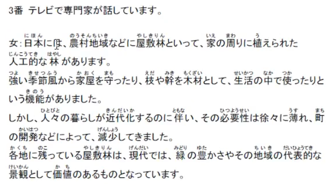

- 概要理解
- 修饰成分不重要，句子重点在后半段

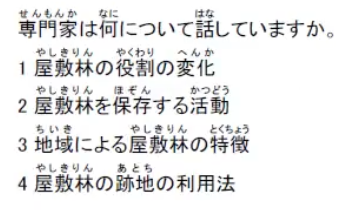

## 2.问题1提前看选项

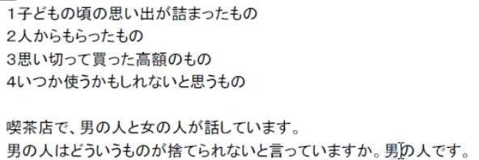

- 看文章对本选项的态度，一般按选项顺序出
- 问女声的态度，男声的态度就可以无视（反之）

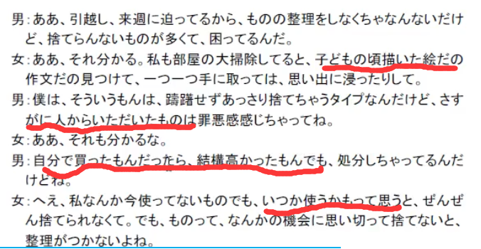

## 3.听力问题一问题二规律

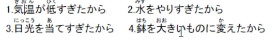

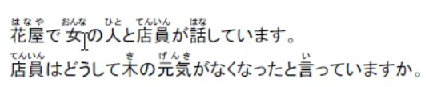

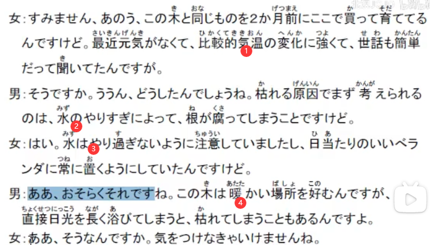

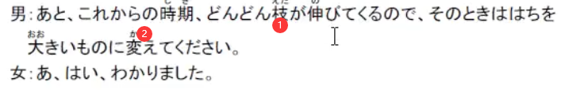

1. 根据选项知道内容
2. 会在文章中按顺序提到

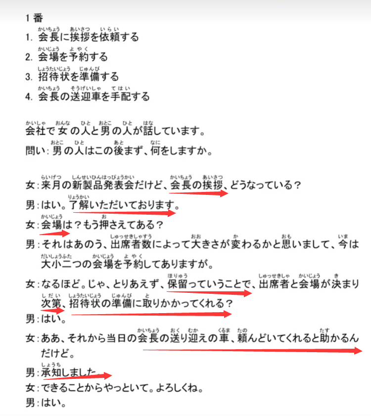

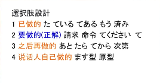

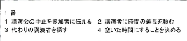

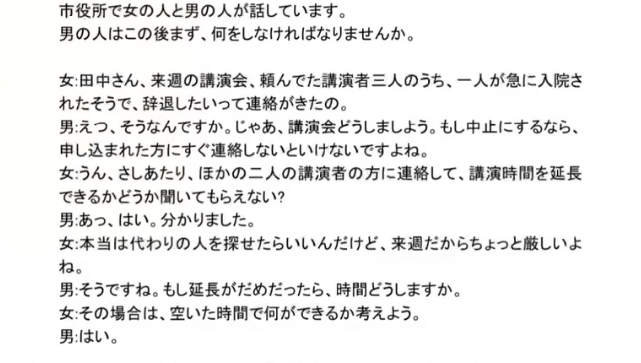

## 4.听力短文选项模板

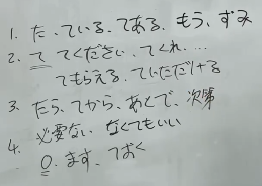

1. 已经做了的
2. 要做的，请对方去做的
3. 做完。。之后再需要去做的
4. 说话人自己会做什么

## 5.听力短文技巧实战

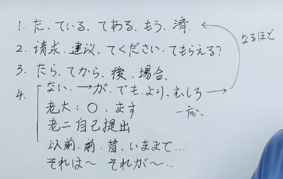

## 6.听力问题5

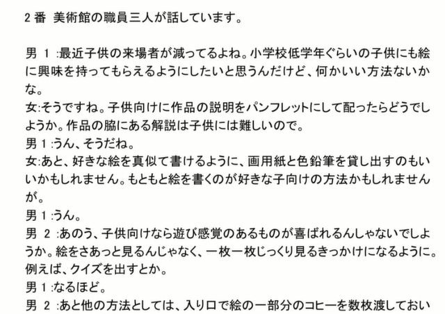

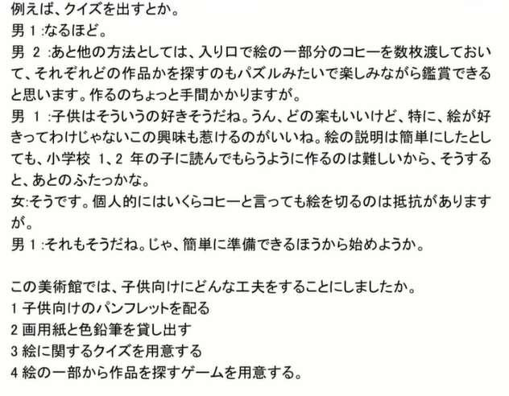

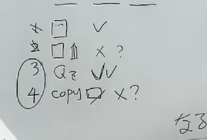
