## 1.动词变形

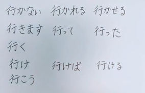

| 否定 | 被动 | 使役 |
| ---- | ---- | ---- |
| ます | って | った |
| 原型 |      |      |
| 命令 | 假定 | 可能 |
| 意志 |      |      |

## 2.んです

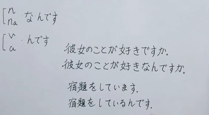

强调原因解释，不单独成句

1. 【你为什么。。。是因为。。。么】
2. 【我。。。了，是因为。。。】

## 3.进行时表状态

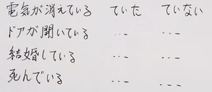

- た表示最近发生了什么事（而不是状态）
- ている表示某一状态正在存在
- ていた表示在过去的某一时间点来看这一状态已经存在

## 4.敬语框架

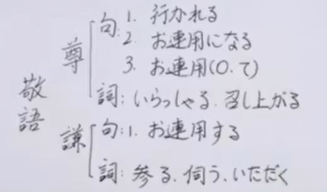

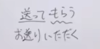

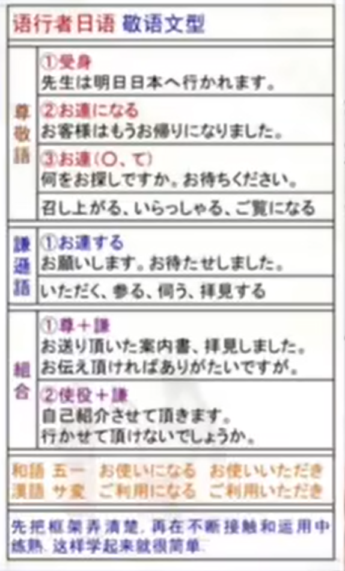

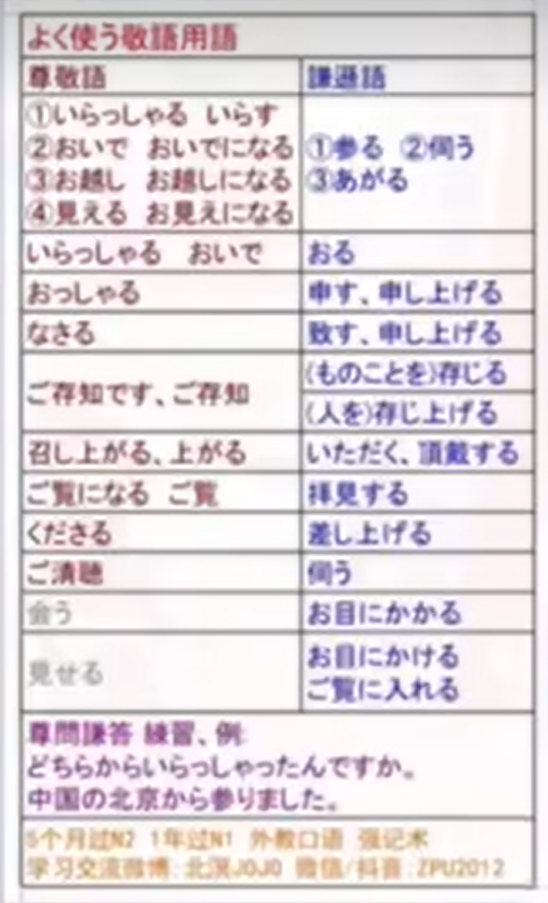

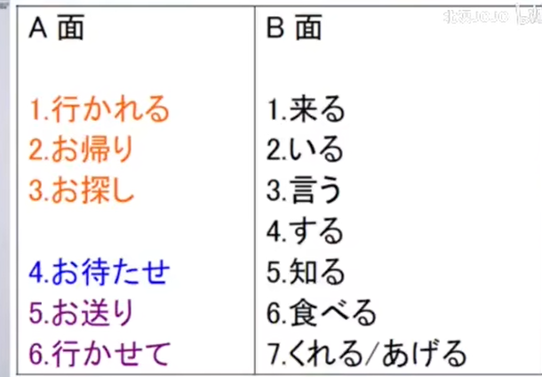

## 5.表假定

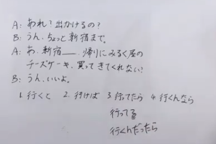

1. 客观的规律或习惯；
2. 假定形：如果A就能B（条件）
3. 行ってる进行时表状态，たら如果A达成，那就可以选择去做B。这里表示如果已经到了，这里是预备出门所以还没到。行くんだったら表述正确
4. なら如果要做A的活可以这样做

## 6.促音规律

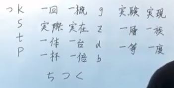

## 7.音读规律

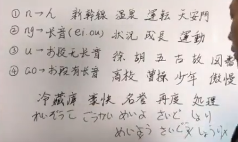

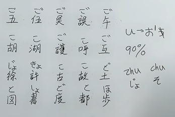

## 8.授受动词

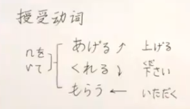

## 9.自动词、他动词、使役动词

1. 自动词使役形可以当他动词
2. 许多他动词是由使役形变形
3. 使役形都是新的他动词
4. す结尾大部分都是他动词

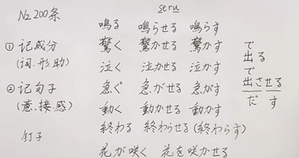

## 10.名词で・动词て

1. 名词、形容动词用で（没有变形）
2. 动词形容词用て（有变形）
3. **都表示前提，方式，原因**

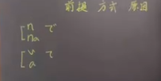

## 11.あの人は・あの人が

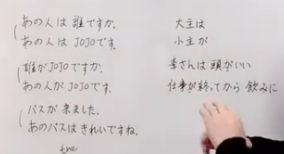

- は重点在主语
- が重点在后续

## 12.被动型

1. 李さんは部長にほめられました
   - 直接被动，动作发生在主语身上
2. 馬さんは森さんにカメラを壊されました
   - 间接被动，动作发生在宾语身上
3. 陳さんは飼ってた小鳥に逃げられました。/雨に降られた。
   - 动作影响了主语，但是动作的落点并不在主语或者宾语身上
4. 2010年に、上海で万博が開かれました。
   - 突出事情被做

## 13.和语词和汉语词

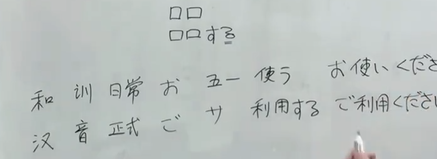

## 14.助词

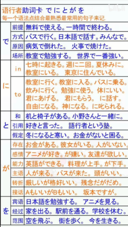

## 15.冷める・冷える

　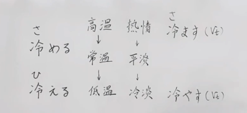

## 16.动词变形、分类

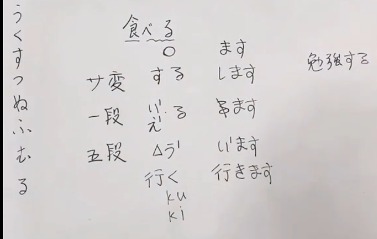

## 17.たら、と、ば、なら

1. たら　主观
2. と 客观存在规律，习惯
3. ば 条件
4. なら 如果要。。。的话，建议。。

## 18.形式名词

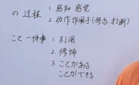

## 19.しといて、しとく

しといて＝しておいて

しとく＝しておく

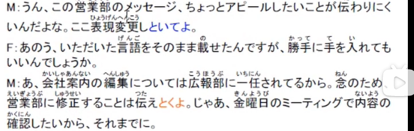

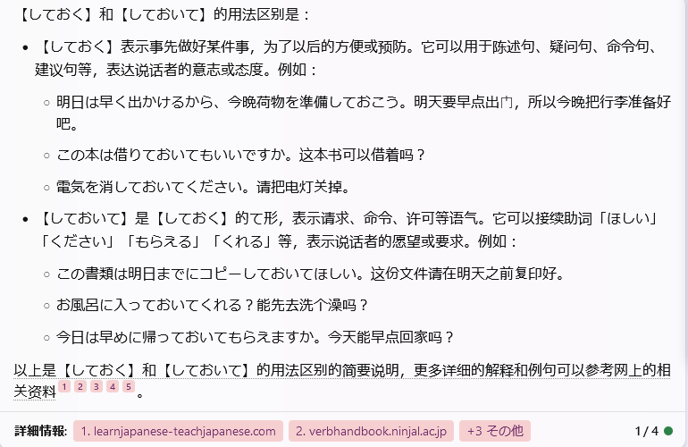

## 20.单词记忆思路

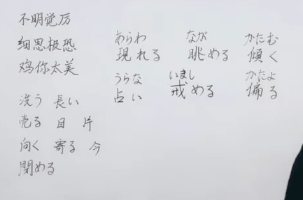

用已经记忆的短单词的变形去记忆长单词

## 21.よう、みたい、らしい

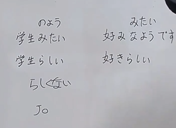

1. みたい・のよう、像别人
2. らしい，像本来的样子

1. よう・みたい、好像是这么一回事
2. らしい（そうです），听到某种传闻，或者看到某种资料从而得出一个结论，翻译为“听说好像”

## 22.わけ、はず

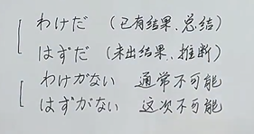

## 23.敬体，简体

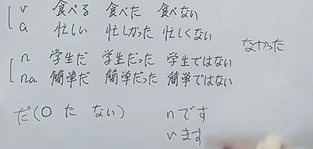

## 24.てある

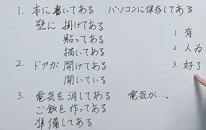

## 25.形容动词、名词|动词、形容词

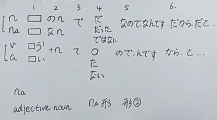

## 26.什么情况下に转换为から

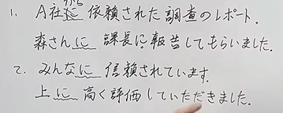

## 27.常见的几种选项（使役形和被动使役）

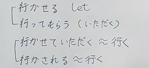

## 28.でも

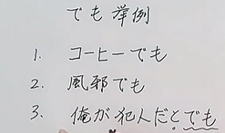

1. 方案的举例
2. 原因的举例

## 29.敬语、尊问谦答

 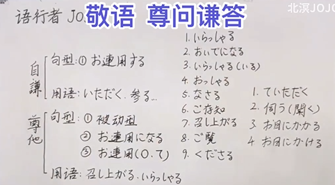

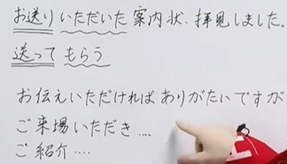

## 30.たいvsたがる

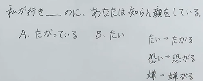

## 31.向け・向き

1. 向け ←vt　向ける面向
2. 向き　vi　向く　适合

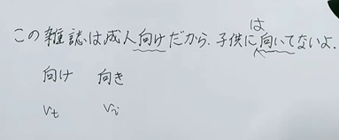

## 32.うち・うちに、間・間に、まで・までに

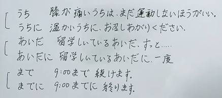

## 33.たところ・たばかり

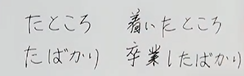

すみません、お待たせしました。

ー私も、着いたところです。

長沙(ちょうさ)にきたばかりです

1. ところ表示现实意义上刚刚
2. ばかり表示概念上刚发生，实际上可能已经过了一段时间

## 34.あげる・やる

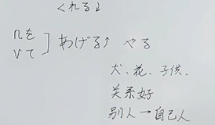

## 35.使役形

1. 原本动词是自动词，动作的执行者后的介词用を
2. 原本动词是他动词，动作的执行者后的介词用に

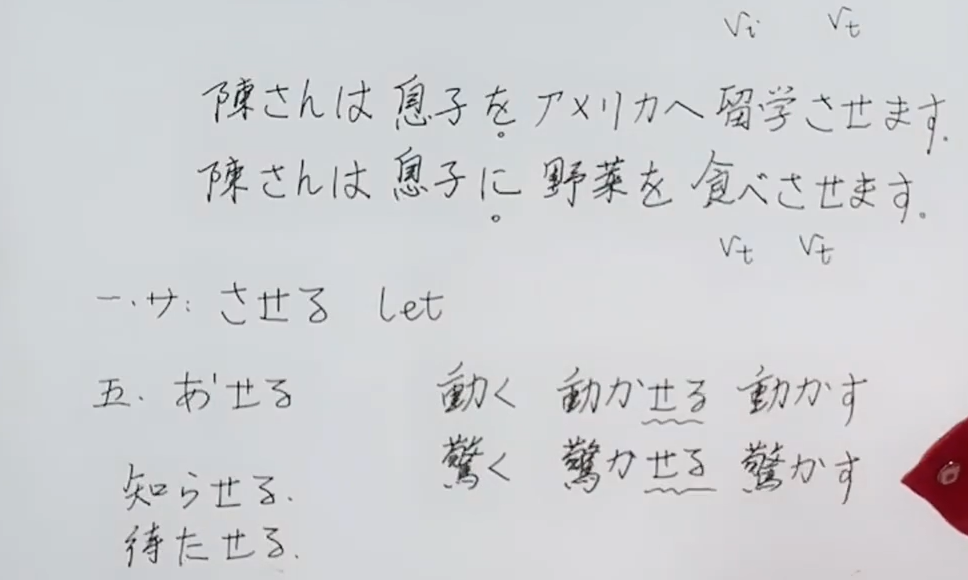

## 36.动词名词化

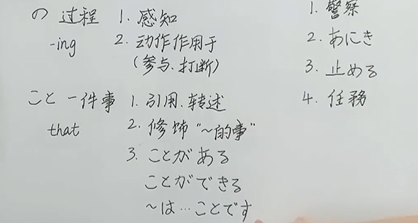

## 37. から・ので

1. から：一般普遍的因果关系
2. ので：解释个人的原因

## 38.たい・ようと思う

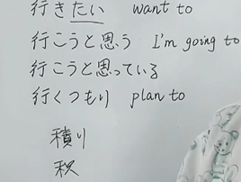

1. たい：个人的想法，愿望，并不一定行动
2. 意志形+と思う：有着这种想法并计划实施

## 39.やめる・とめる

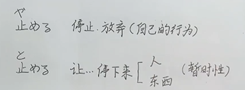

## 40.中　じゅう・ちゅう

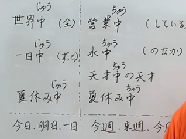

## 41.やりきる

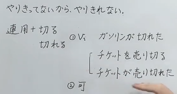
