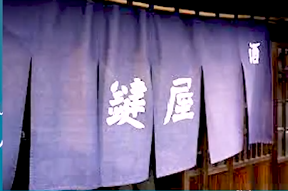

# ＃6

|                      | AそばからB       | AなりB           | Aが早いかB    | Aや否やB     |
| -------------------- | :--------------- | ---------------- | ------------- | ------------ |
| とき                 | 過去のこと       | 過去のこと       | 過去のこと    | 過去のこと   |
| AとBの関係           | Bがよくないこと  | Bがよくないこと  | AとBが同時に  | AとBが同時に |
| 主語                 | AとBの主語は同じ | AとBの主語は同じ | 異なってもOK  | 異なってもOK |
| 回数                 | いつも           | 一回             | 一回          | 一回         |
| 意志動詞・無意志動詞 | 両方             | 両方             | Bは意志の動詞 | 両方         |

## 24.AそばからB

意味：したら、またすぐBの状態になる。

接続：Vる/Vた＋そばから(Vたの方が多い)

**注意点：**

1. **文句や不満を言う場合よく使う。**
2. **いつも同じ結果になる。**
3. **一回で終わることは使わない。**

例文：

1. このブランドのカバンは店内に**置いたそばから**、売り切れてしまう。
   - **カバン**
     1. **皮包、公文包、手提包。**
2. あのラーメン屋さんは、外に<u>暖簾(のれん)</u>を**掛けたそばから**、長い行列が出来ました。
   - **暖簾**
     1. **(挂在商店屋檐下，用于这样，引有商标和店号的)布帘。亦有广告作用；**
     2. **(与竹帘重叠挂在禅宗寺院入口处的)冬天御寒布帘；**
     3. **(挂在室内以遮挡视线、隔开房间和装饰作用的)布帘**
     4. **商店的字号，信誉，商誉。**
   - 
3. 娘は新しい服を**着たそばから**、服を汚す。
4. うちの子は部屋を**片付けたそばから**、おもちゃを散らかす。
5. 給料を**貰ったそばから**、彼女のプレゼント代で消えていく。
6. 英語は難しい。新しい単語を**見たそばから**、忘れてしまう。
7. 上司からいつも指示を**聞いたそばから**忘れると言われてるからメモ帳を<u>持参(じさん)</u>している。
   - **持参**
     1. **携带，带**
8. 最近<u>年(とし)</u>のせいか、**聞いたそばから**忘れてしまう。
9. 一つの料理が**終わったそばから**新しい注文が入ってくる。
10. N1の漢字は難しい過ぎて、**覚えたそばから**忘れていく。
11. 作業を教えて**貰ったそばから**、忘れてしまった。
12. 仕事の終了ベルが**鳴ったそばから**、スタッフは食堂に向かって走り出す。
13. このブランドの財布は営業を**開始したそばから**、売り切れてしまう。

## 25.AなりB

意味：

Aしたら、すぐBの状態になる

接続：　Vる＋なり

注意点：

1. **一回に限る出来事。**
2. **Bには意志や命令文は使えない。**
3. **Bはネガティブな場合が多い。**

例文：

1. 社長は部屋を**出るなり**、現場に向かって行った。
2. 家を**出るなり**、空が暗くなって、
3. 彼女は部屋に**入るなり**、浴槽に入り、泣き出した。
4. 部屋に**入るなり**、父から電話がかかってきた。
5. 彼は車に**乗るなり**、猛スピードで走り出した。
6. 女子高生が部屋に**入るなり**、A容疑者は<u>卑猥(ひわい)</u>な言葉を投げかけた。
   - **卑猥**
     1. **没品位，放荡的样子或者其状态**

7. 俺は家族の事が大嫌いで高校**卒業するなり**、家からで出たんだ。
8. 現場に**入るなり**、殺人の動機を調べ始めた。
9. 俺が玄関に**入るなり**、犬がやって来た。
10. 娘は部屋に**入るなり**、変な声を出しながら、電気を付ける。

## 26.Aが早いかB

意味：

1. Aしたら、すぐBの状態になる。
2. Aが早いか、Bが早いかか分からないぐらい**同時**に起こる。

**注意点：**

1. **Bは<u>意志動詞のみ</u>で使われる。**

接続：

Vる/Vた＋が早いか

例文：

1. チャイムが**なるが早いか**、生徒たちは<u>弁当(べんとう)</u>を取り出して食べ始めた。
   - **チャイム**
     1. **门铃**
2. 5時に**なるが早いか**、社員たちは事務所を飛び出していった。
3. ラーメンがテーブルに**置かれるが早いか**、麵を<u>啜り(すすり)</u>始めた。
4. ラーメン次郎に行く時は、メニューは決まっているからお店に**入るが早いか**、自販機から<u>大盛(おおもり)</u>ラーメンを買っている。
5. 給料を**貰うが早いか**、全員飲み屋を探し始めた。
6. 息子はご飯を食べ**終わるが早いか**、外に遊びに行ってしまった。
7. 娘は家に帰るが早いか、友達と一緒に出掛けていた。
8. 息子は大学生を卒業する息子は大学を**卒業するが早いか**、<u>世界一周(せかいいっしゅう)</u>を始めた。
9. 彼はとてもお腹が<u>空い(すい)</u>ていたので、**座るが早いか**、「頂きます」も言わないで食べ始めた。
10. 空港で**出会うが早いか**、激しくきすをするカップルを見て、羨んだ。
11. 面接結果のお知らせの電話が鳴るが早いか、<u>受話器(じゅわき)</u>を取った。

## 27.Aや否やB

意味：Aするかしないか、分からないぐらい短い時間でBが起きる。

接続：Vる＋や否や

例文：

1. 彼はご飯をたべ**終わるや否や**、直ぐに誰かに電話をかけていた。
2. 赤ちゃんはめを**つむるや否や**、すやすや寝始めた。
3. 社員達は給料を**貰うや否や**、事務所を飛び出していて、新宿に遊びに行く。
4. 野良猫は<u>雛鳥(ひなどり)</u>を**捕まえるや否や**、<u>獲物(えもの)</u>を<u>喰(く)わえた</u>まま木の上に逃げ出した。
5. 部屋を**開けるや否や**、彼女が部屋に飛び込んで入った。
6. 子供は親の姿を**見るや否や**、泣き出した。
7. 彼の店の掃除が**終わるや否や**、店長に電話をかけた。
8. 部屋に**帰るや否や**ベッドで横(よこ)になってスマホを見始める現代人。
9. 警察は警察が来るのを**見るや否や**逃げ出した。
10. 息子は大盛のラーメンを食べ**終わるや否や**、餃子と唐揚げを<u>頼んだ(たのんだ)</u>。
11. 息子はテーブルに**座るや否や**、肉を焼き始めた。
12. 彼女は家に帰るや否やパソコンの**電源を付けた**。
13. 彼は分からない問題が**出るや否や**ググり始めた。
14. 川に<u>糸(いと)</u>を**入れるや否や**超でかい魚が<u>採(と)れた</u>。
    - **糸**
      1. **纱线，用于纺织，手工编织，缝衣，刺绣等；**
      2. **生丝；**
      3. **(乐器的)弦，琴弦；**
      4. **钓线，钓丝，鱼线；**
      5. **线状，似线的细长物；**
      6. **线索，途径，线路。**
15. ジャニーズはチケットを**発売するや否や**売り切れてしまった。

