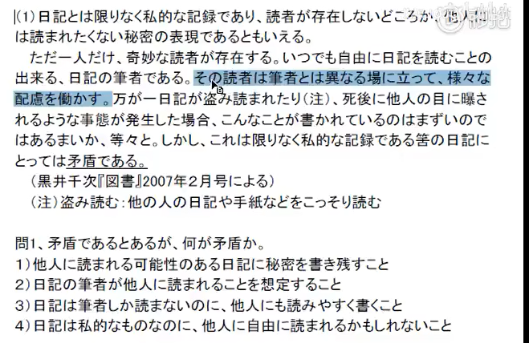
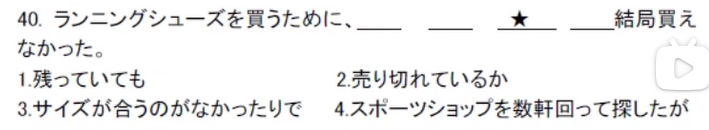
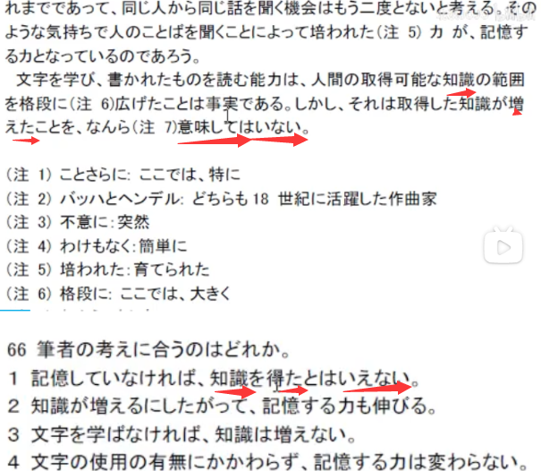
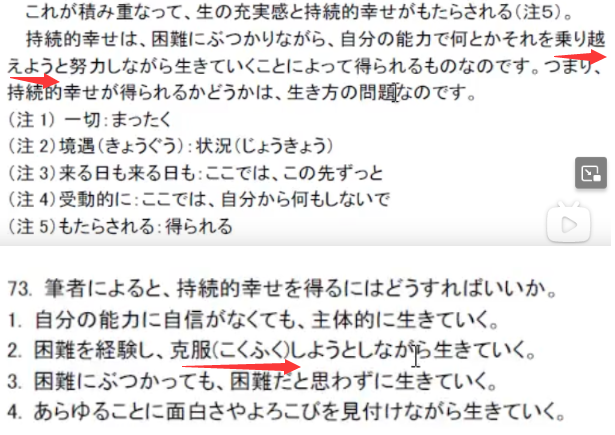
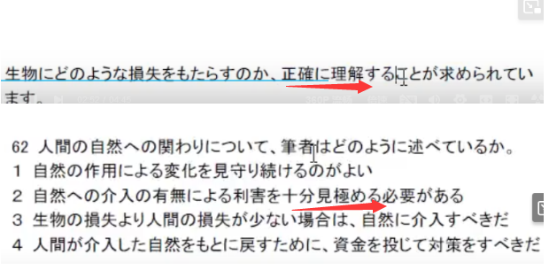
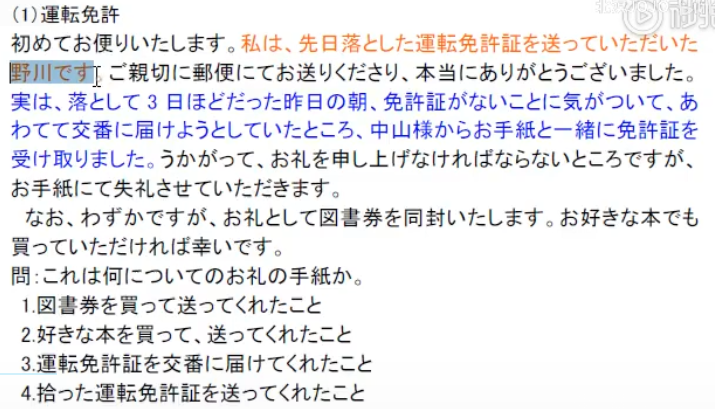
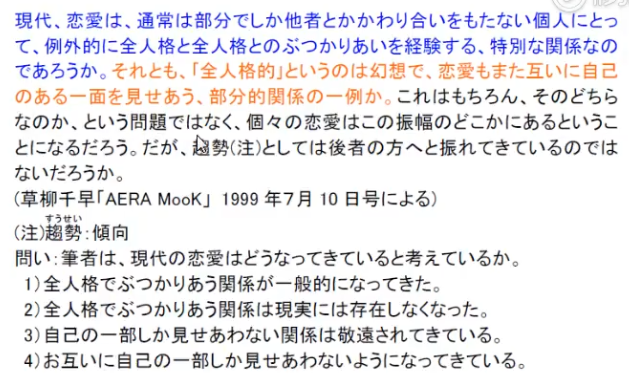
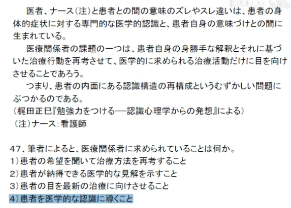
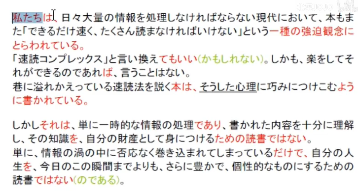
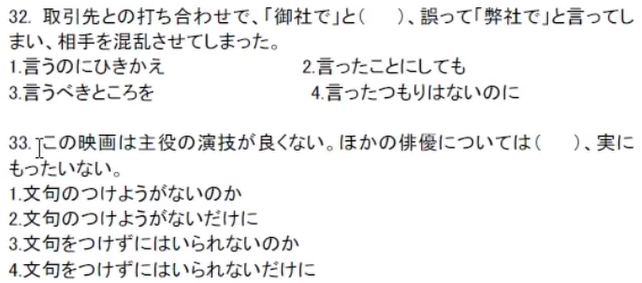

## 1.问题8阅读出题思路

1. 两个炮灰选项
2. 两个候选项都与关键句有关
3. 正确选项：
   1. 喜欢用近义词
   2. 结构不变
4. 干扰项：
   1. 与中心句有关
   2. 用原句词
   3. 改变原意（主体、结构改变）

## 2.长文阅读解答公式

- 正确答案就是把原文的句子换一种表述方式
- 每个单词都在原文中能找到的是干扰项

## 3.排序题问题6

1. 从最后一个空考虑
2. あった前接名词主语，选3
3. 动词原形大部分接名词，という前接引用后街名词
4. 意思和接续结合
5. 1423

1. 从最后一个考虑
2. 能增加的只有若者
3. 动词原形接名词，なんていう 接若者
4. という、什么样的，前接形容，选4
5. 2413

1. と思うと引用搭配，34连在一起
2. で表示前提，234连接
3. それだけで前面部分内容总括，2341

1. 从后考虑，能接续と思う的只有1、2，前面接续一个完整的句子
2. 看前面，子供是したい还是やりたい，やる是为某人做某事，所以前面接1，，末尾选2
3. “想做的事”，14
4. 1423

1. 2动词原形接名词，に前接名词，24确定
2. 第二空是名词，后接介词，3
3. 2431

1. の名词接名词，3是名词，最后是名词，最后两空23
2. な形容后接名词，432
3. 1432

1. なぜだろう，确定最后是3
2. のは常用来动词名词化，需要动词名词化的是4，确定14连接
3. に連れて随着，前接年をとる，2143

1. な后接名词，が前接主语，4第一，1第四
2. で前提、方式、原因，后接动词，42_1
3. 4231

1. 4后跟修饰主体，跟2
2. 动词直接接名词，423
3. と表示假定，1423

1. うちに前接过程，4是过程，14连接
2. た形接名词，23
3. 2314

1. が多用于句子后转折或者名词后提示主语
2. 1324

1. の常用于前后接名词表修饰或者前接动词名词化
2. 一日前缺少修饰词
3. 1423

1. のは动词名词化，前接动词原形
2. ならともかく，~就算了
3. 1324

1. 根据意思，一空选3，という前接引用，后接被形容的名词
2. 4中的の前后接名词
3. 1中的を前接宾语后接谓语
4. 3412

1. 4与空前逻辑符合，排第一个
2. 2中的か表示两种情况中的其中一种，接续1，卖完了或者买剩下的
3. 4213

1. 修饰词要在修饰主体前面
2. 晴雨にかかわらず用来修饰毎日，所以选4132

1. 结尾的是1或者4，1是取得，4是取决于，故4结尾
2. 1接续名词3，2是状语，后接1
3. 2134

## 4.问题9、10中长篇最后一题

1.

1. 直接看最后一段
2. 找近义词
3. 选1

2.

3.

4.

## 5.短文句子结构

1. 句子重心在最后，主语在最前
2. 看标点，看助词，看变形

1. の搭配が，内容可以无视，表肯定
2. 4

## 6.抓住句子主干

1. 先看开头主语和最后的
2. 再看每一个小节的主语和谓语
3. 最后再看中间的名词和副词

1. 主语：は、が、も
2. 谓语：最后

## 7.语法题

1. 余儀：其他办法，其他事情
2. 控える：
   - 等候，等待
   - 在旁边，在近旁
   - 勒住，拉住，拽住
   - 节制，控制，抑制
   - 暂不，打消...的念头
   - **面临，靠近**
   - 写下来，记录下来
3. に過ぎない只不过是
4. ならでは：只有...，除非...
5. あるまい：ないだろう

1123

32

1. 出ようとする：意志形，正要出去
2. に連れて：随着
3. 途端に：正当...的时候

32

引き換え-交换，对比

べき-应该做

ことにしても即使做了

つもりはない没有这种想法

44

1. なら：早知道的话
2. じゃなかった不应该
3. に こしたことはない：最好...
4. なりそうですらない：完全没有...的迹象
5. すら：甚至...，连...
6. ならないともか　切(ぎ)らない：无法确定会不会...
7. 
