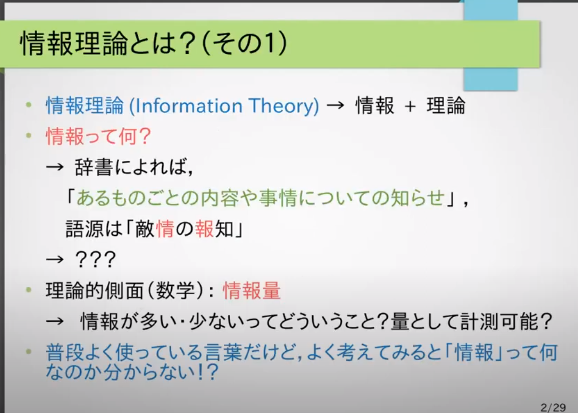
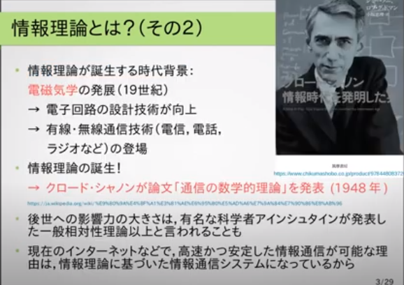

# ～第1回　序論(ガイダンス)

## 情報理論とは？

## 情報の転送プロセス

全文字でも音でも画像でも動画でも、全部2進数で置き換える、数値として表現できるでそれを通信送るということ。

## 本授業の目的

## 評判基準、参考書

## 履修におかける注意

## 単語

#### 序論

#### 電磁気学

#### 計測

#### 置き換える

#### 符号化

#### 復号

#### 囲う

#### 圧縮

#### 桁数

#### 冗長

#### 履修

#### 確率

#### 統計

#### 同時確率・同時確率分布(ぶんぷ)

joint distribution・joint probability distribution

联合分布

#### 周辺分布・周辺確率分布

marginal distribution・marginal probability distribution

边缘分布

