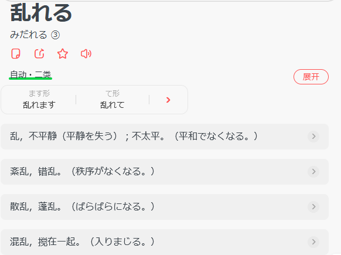
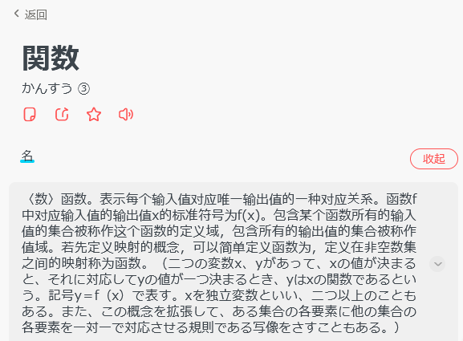
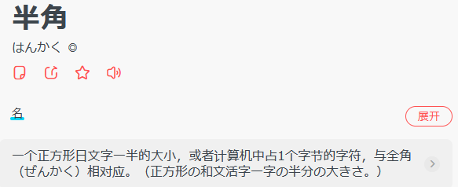

# IT日语速成 1

## 日语翻译特点

1. 日语是黏着语，要靠助词来表示各个单词在句中的机能。
2. 日语主语在首，谓语在最后。跟汉语最大的区别就是主谓宾。故翻译的时候要从后向前。

## 动词

## 助词

## 补充单词

#### モジュール

#### 関数

#### ウインドウ

#### レビュー

#### 定数と変数

常量和变量

#### 遷移

页面跳转

#### クライアント

客户端

#### サーバ

server；服务器

#### ファイル

file；文件

#### 格納

#### 稼働

运作，运转

#### 日報

#### 論理削除

逻辑删除

#### レコード

#### 半角

#### ローカル

#### 仕様書

### 其他单词补充

