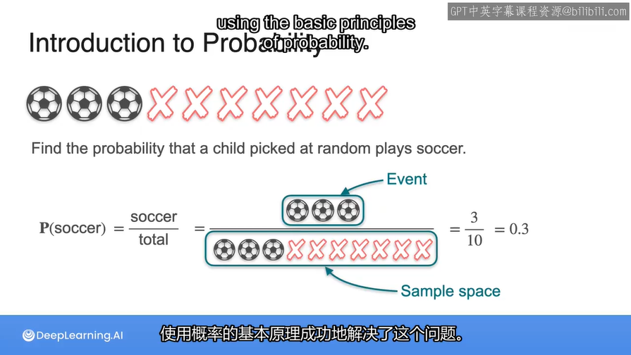
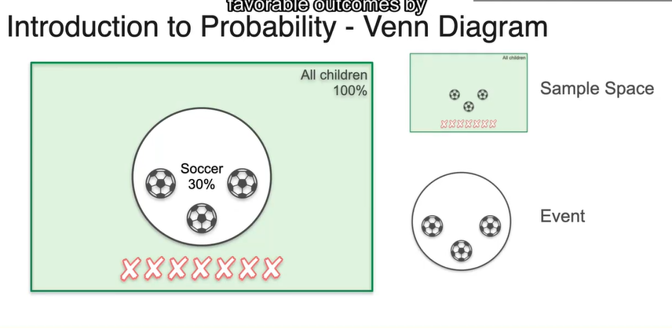
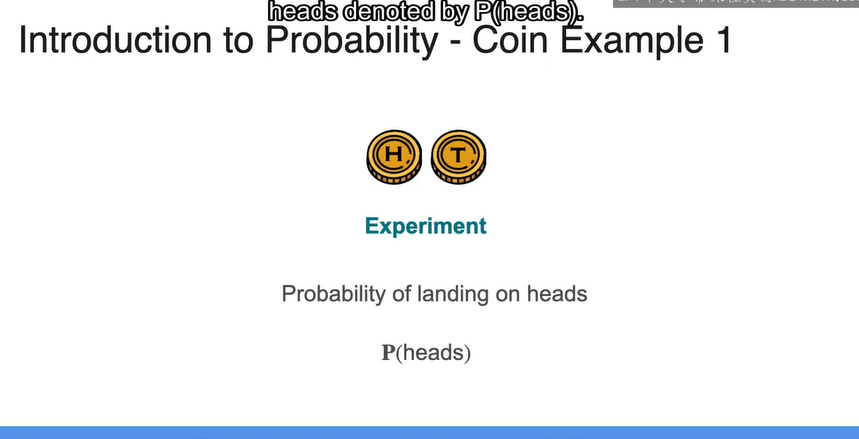
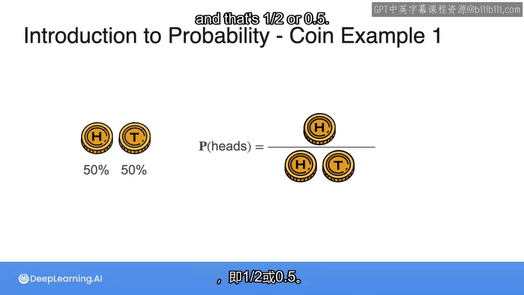
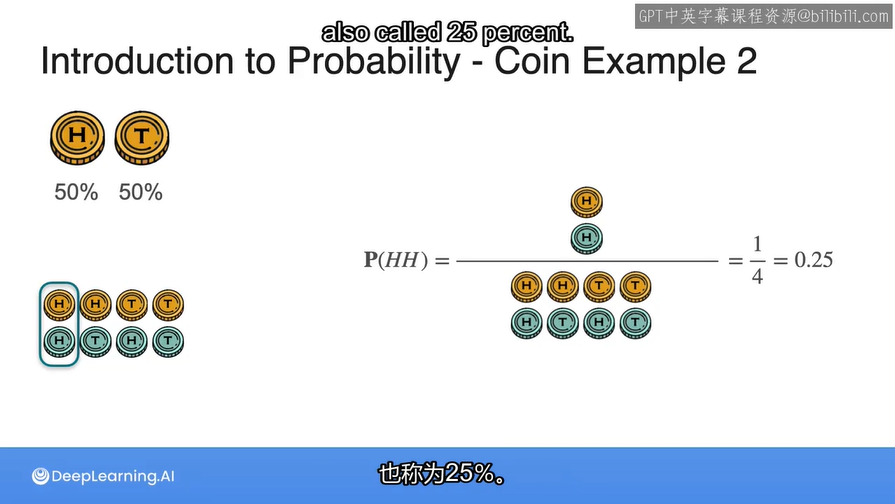
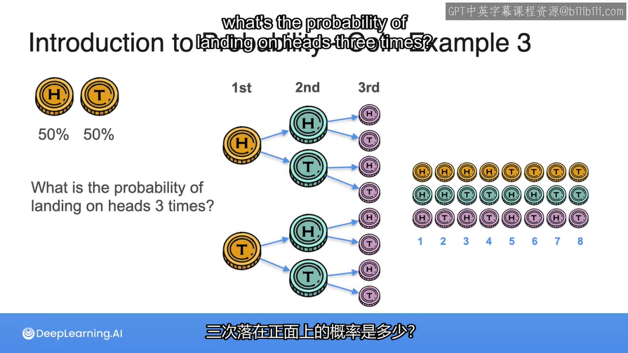
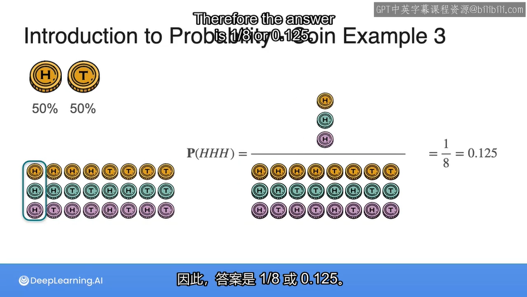

# Introduction of probability

In the first lesson,you will learn how to calculate probability for different types of random events using rules of probability and Bayes' theorem.

In lesson 2,I'll introduce you to the concept of probability distribution and some examples of commonly used probability distributions.

## What is probability

Probability is a measure of how likely an event is to occur.

### sample space,event Venn diagram(维恩图)

### Experiment

the coin can land in heads or tails,because this activity of flipping a coin producing an outcome that is uncertain,We are going to call this the **experiment**.

In probability,an experiment is any process that produces an out come that is uncertain.

