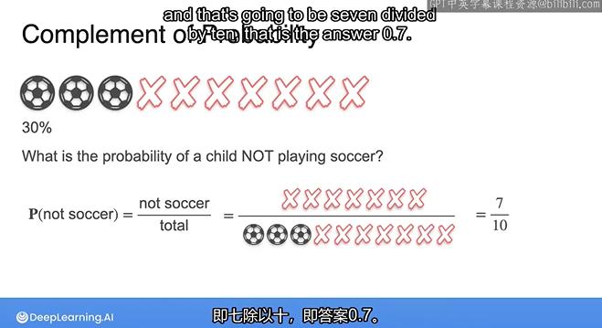
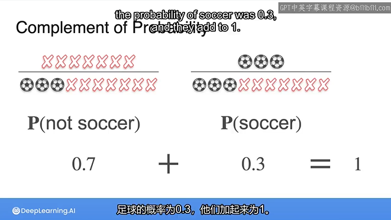
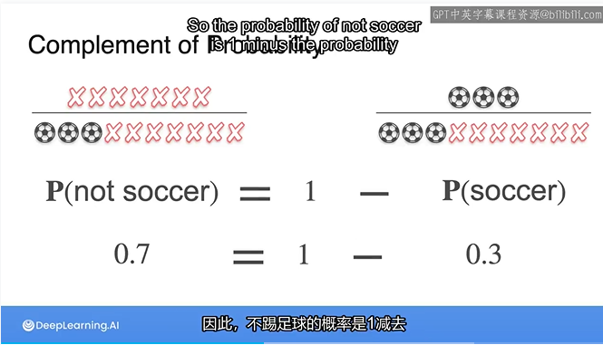
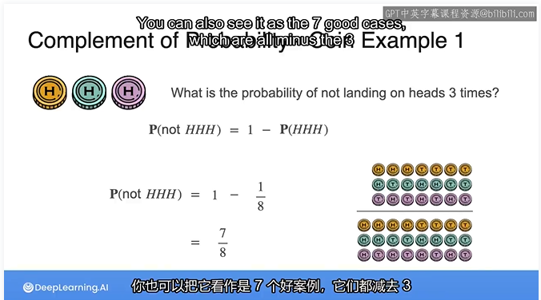
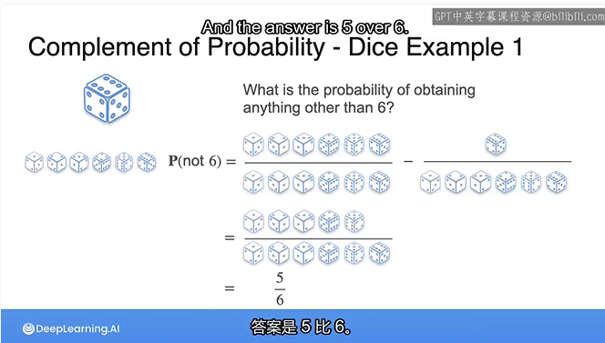

## Complement of Probability

## The Complement rule(补码规则)

the probability of an event A not occurring is equal to 1 minus the probability of A occurring.

$$
P(A')=1-P(A)
$$
where A' represent the complement of the event A.

that's what event A does not happen.

