# Jointed Events

In real-world situations,events are not often disjointed,and we need to account for this possibility of overlapping(重叠) outcomes.

The sum rule(总和规则) for joint events(联合事件) allows us to do this and to calculate the probability of combined events(组合事件).

## Quiz 1

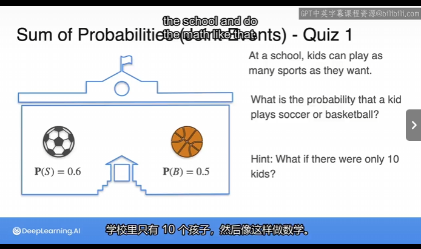

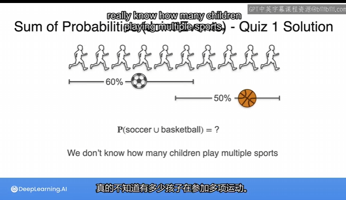

### Solution

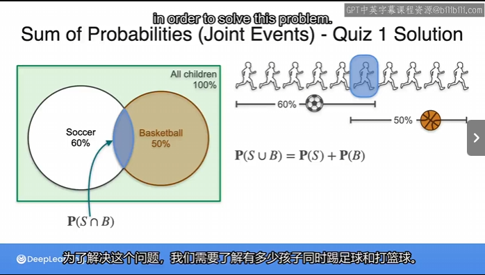

## Quiz 2

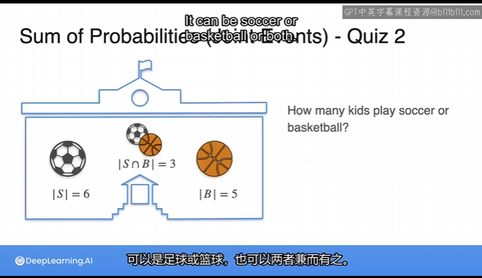

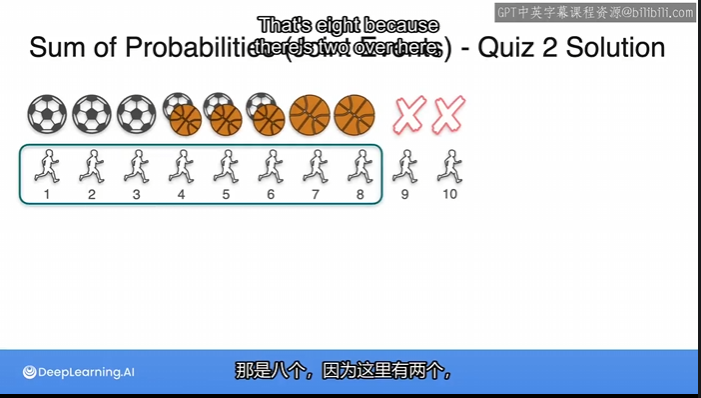

### inclusion-exclusion principle(包容排除原则)

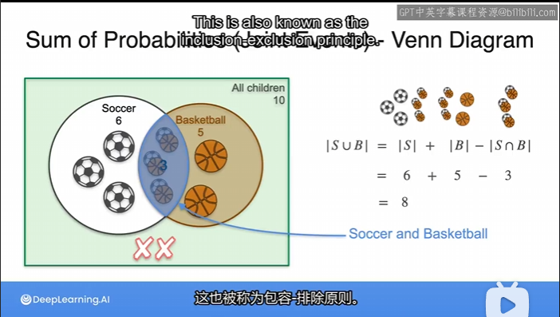

## Quiz 3

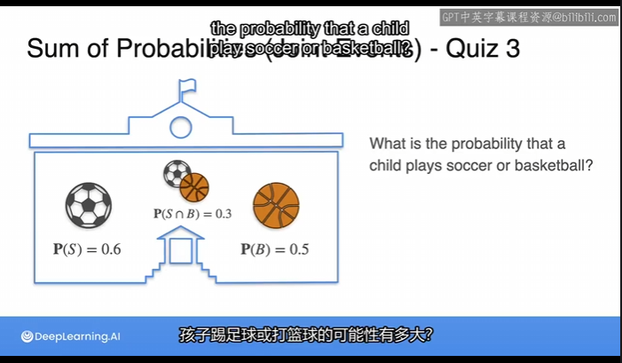

### Venn Diagram

intersection(交集)

union(并集)

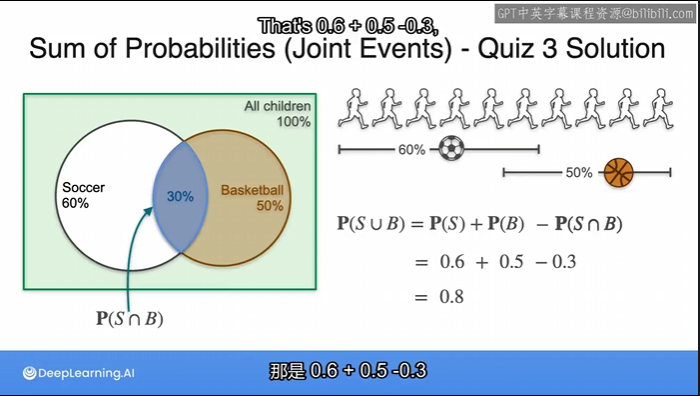

## Disjointed Events vs Jointed Events

Mutually exclusive 互斥事件，不相交事件

Non-mutually exclusive 非互斥

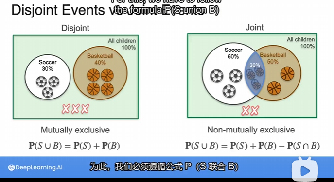

## Dice Example 1

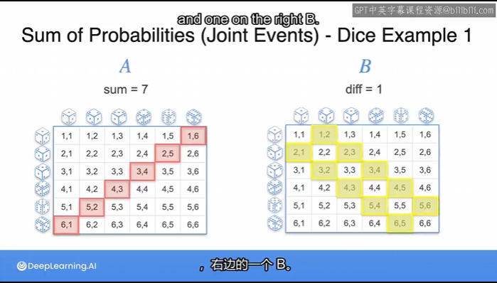

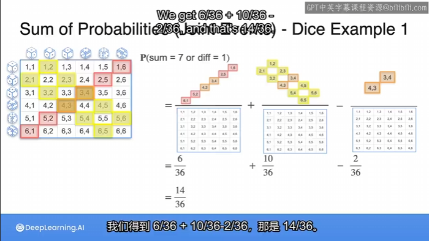