# Independence

Independence happens when the occurrence of one event doesn't not affect the probability of the occurrence of another event.

For example,if I toss a coin twice,whatever happened on the first throw does **not affect** the outcome of the second one.

In the other hand,in the chase,whatever happened on the 10th move **affects** what happens on the 11th move.

 So there are not independent,but the coin throws are independent.

## In machine learning

Understanding independent is very important in probability and in machine learning,because **assuming(假设)** that things are **independent** actually helps us **simplify calculations and make predictions**.

## Quiz 1

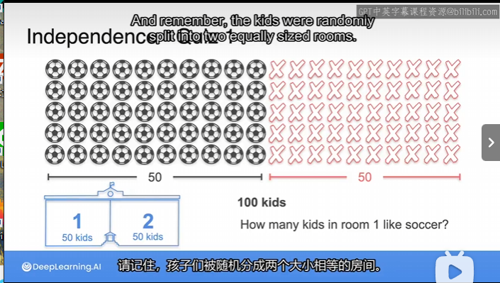

### Solution

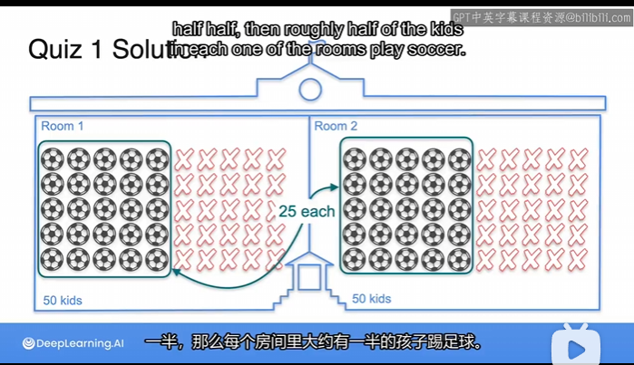

## Quiz 2

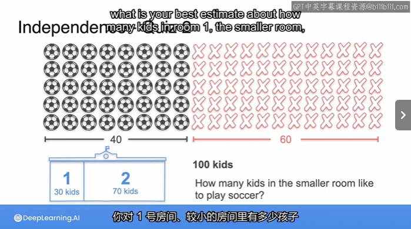

### Solution

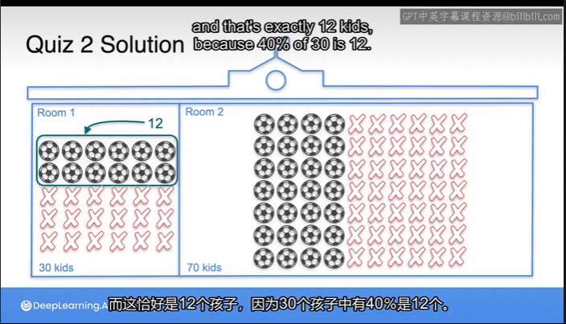

## Independent Events

Those events are not related,are independent of each other,then it's the product(乘积) of the two probabilities P(S) and P(R1).

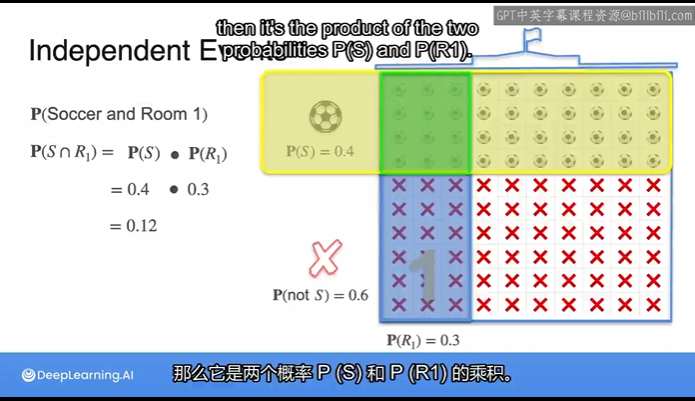

## Product Rule(for independent Events)乘积规则

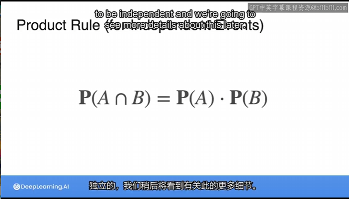

## Independent Events-Coin Example 1

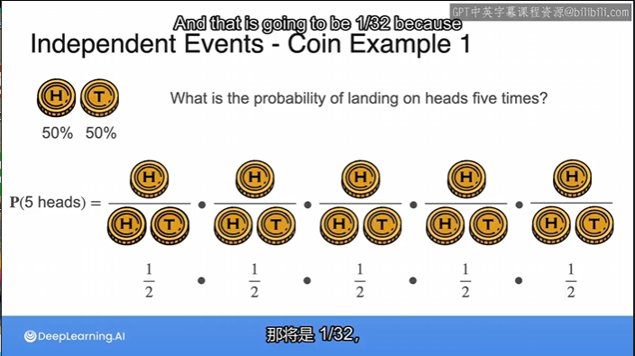

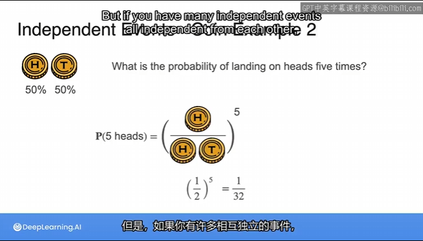

## Independent Events-Dice Examples 1

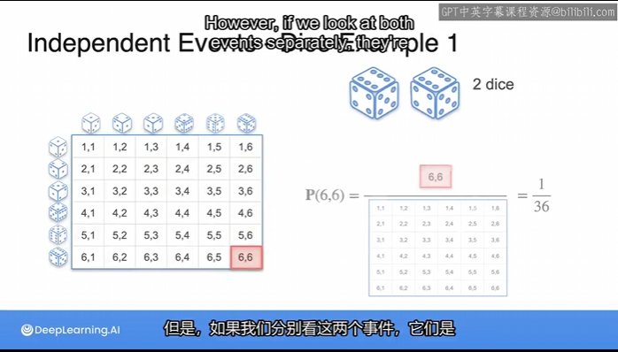

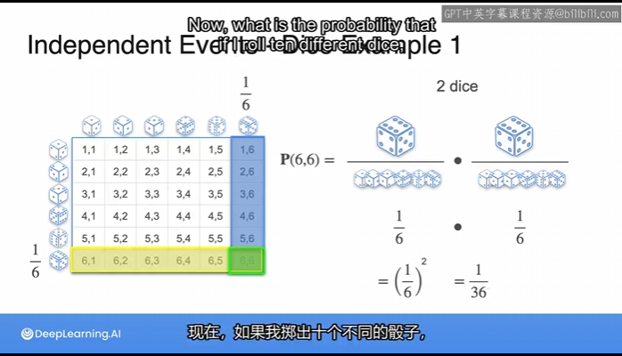

## Independent Events-Dice Examples 2

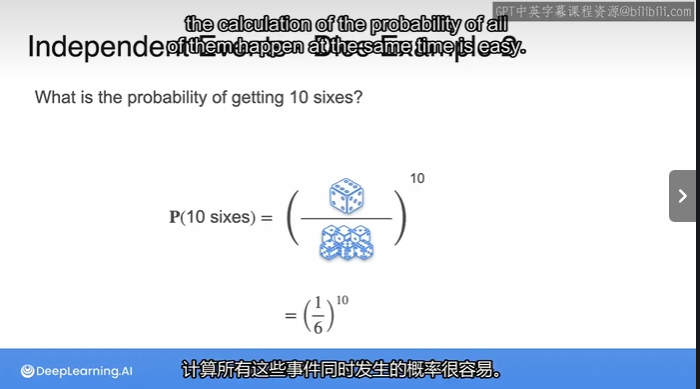