# Conditional probability

Conditional probability is all about calculating the probability of an event happening given that another event has already happened.

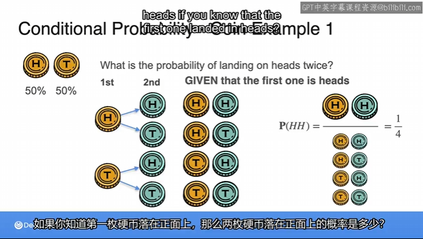

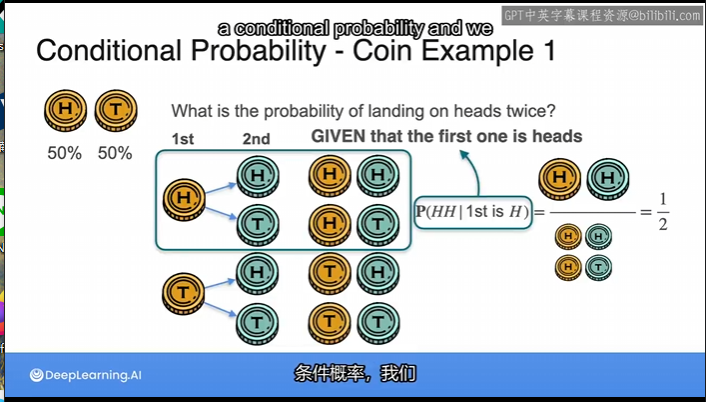

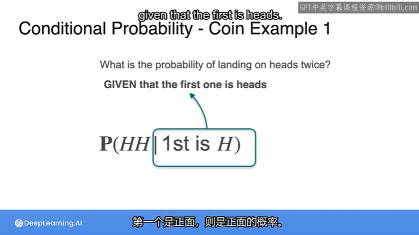

vertical bar :$|$

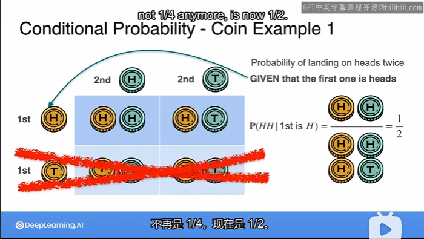

## coin example 2

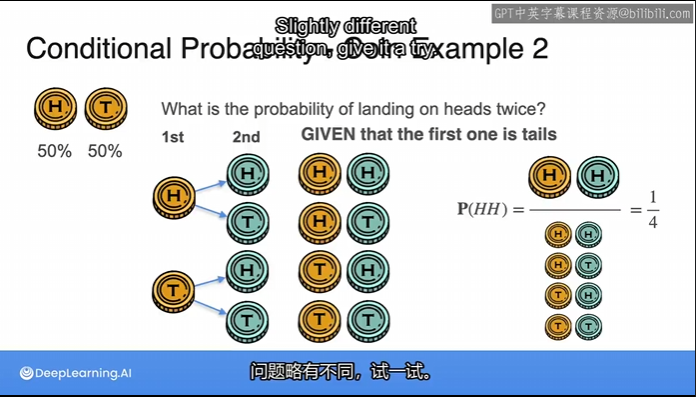

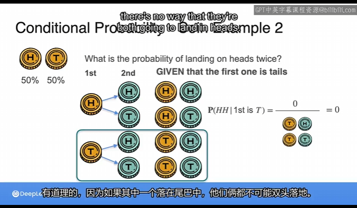

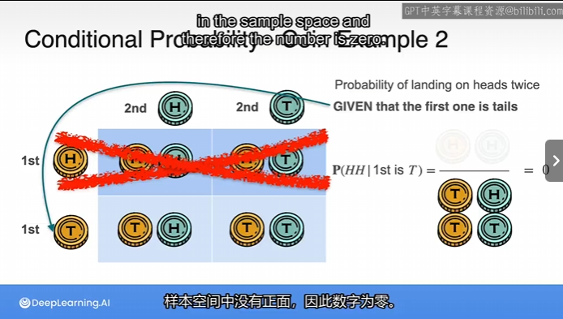

## Dice Example 3

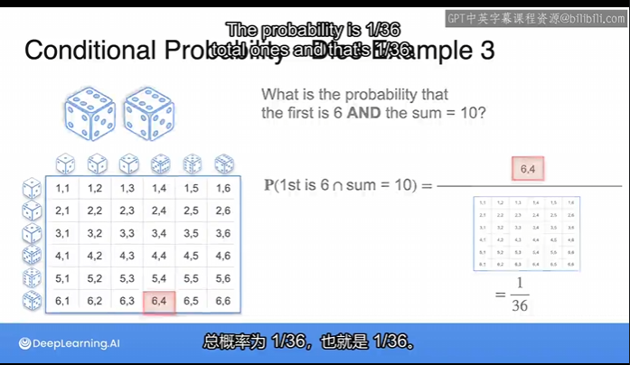

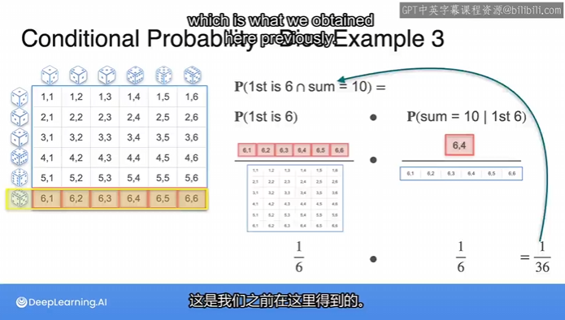

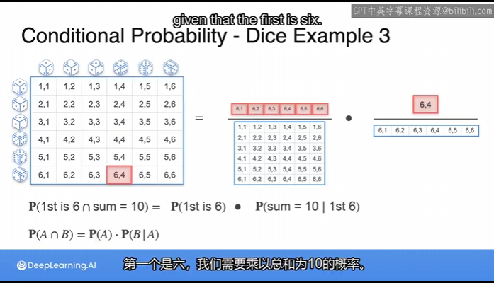

## The General Product Rule(通用乘积规则)

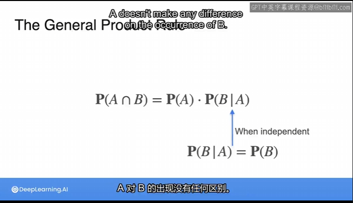

## Dice example 1

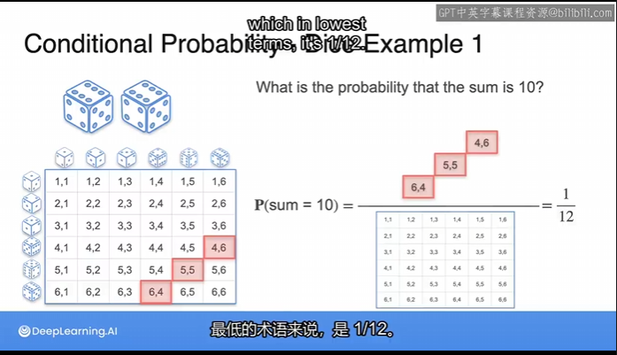

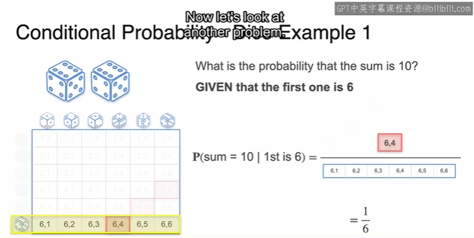

## Dice example 2

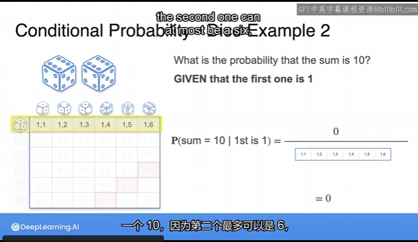