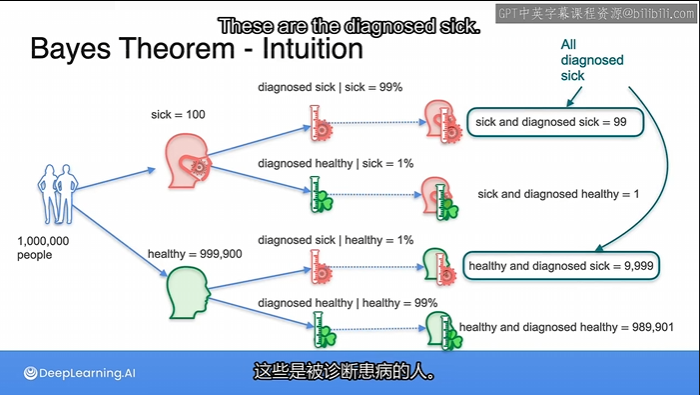
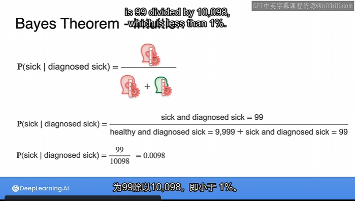

# Bayes theorem 1

There is a rare disease going on and you want to get tested for it . So you go to the doctor and the doctor says, I have a very effective test, which is correct most of the time. 

You take the test and then go home . And then doctor calls and said you tested positive, so may be it's time to panic. But before panicking, I always do some math.

So the idea is to calculate **the probability that you have the disease,given the fact that you tested positive.**

This is an example of Bayes theorem.

## Bayes Theorem-Intuition

