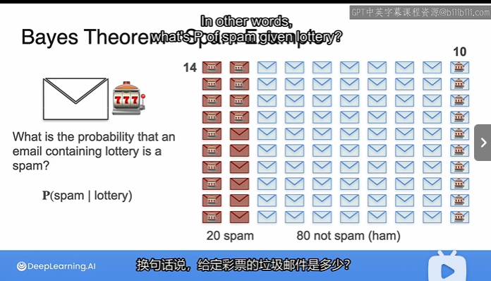
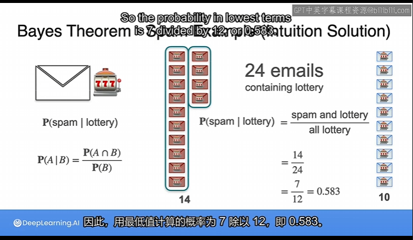
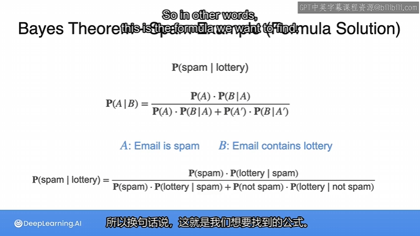
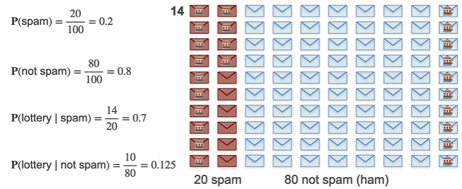
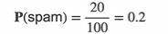
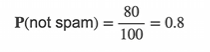
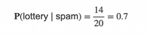
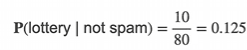
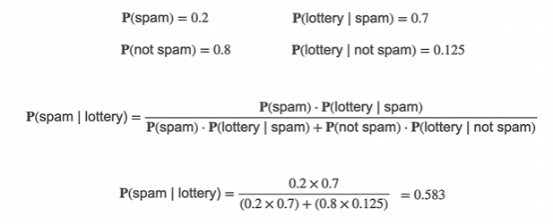

# Bayes Theorem 3

## Formula Solution

$P(A)$ called **prior**

**This is the original probability that you calculate without knowing anything**,

Now, what is the probability of **not spam**

probability of **lottery given spam**

probability of the **lottery given not spam**

