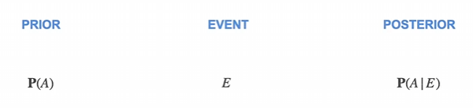
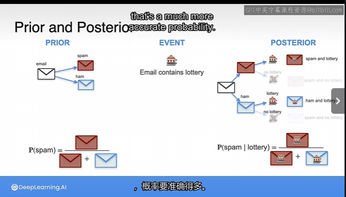
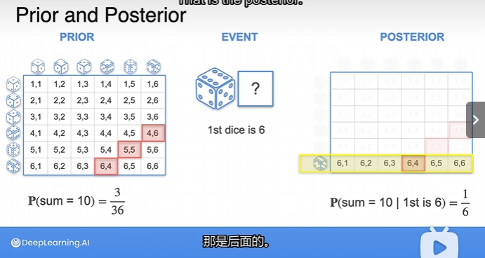
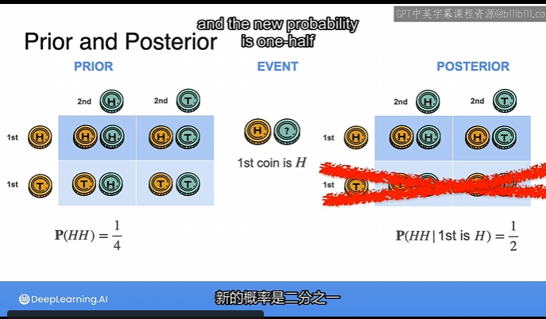

# Bayes Theorem 4

## Formalize

We have something called the **Prior** ,that is the original probability that you can calculate,not knowing anything else.

Then something happens,and that's the **event**.

the **Event** gives you **information** about the probability.

With that information,you can calculate something called the **posterior(后验)**,

the prior is $P(A)$,

an event can be called $E$

the **posterior** is $P(A|E)$

## spam example

The **posterior** is always a **better** estimation than the **prior** because we have that event that gave us **information**.

## Dice example

## coin example

