# 1.3　有限桁2進数による数値表現

## コンピュータにデータを保存する

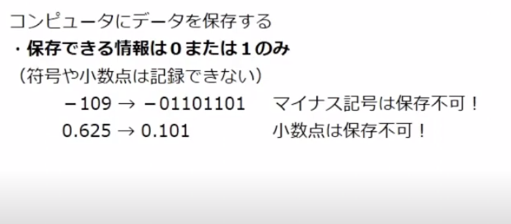

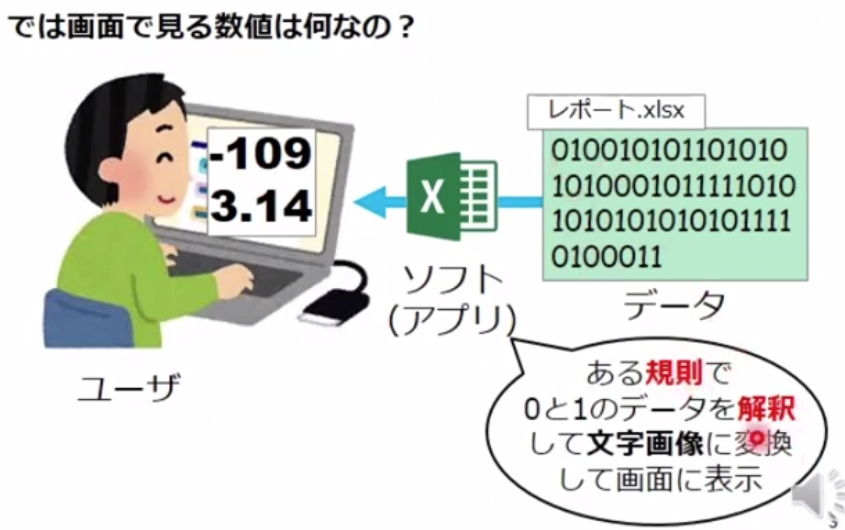

## 01データを数値に対応させる規則

### MSBとLSB

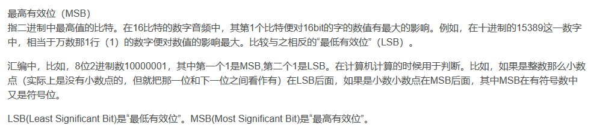

### 符号なし整数

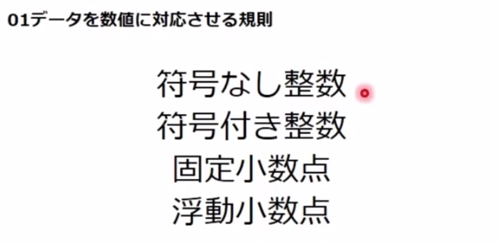

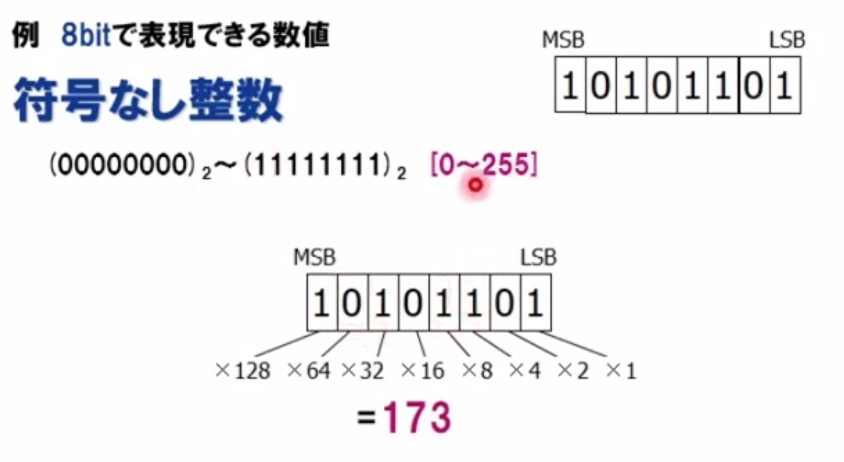

### 符号付き整数

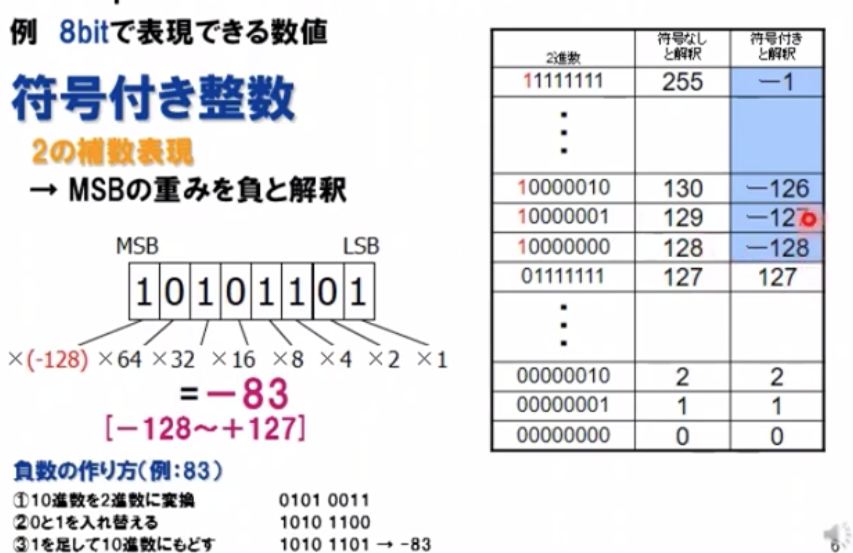

### 固定小数点

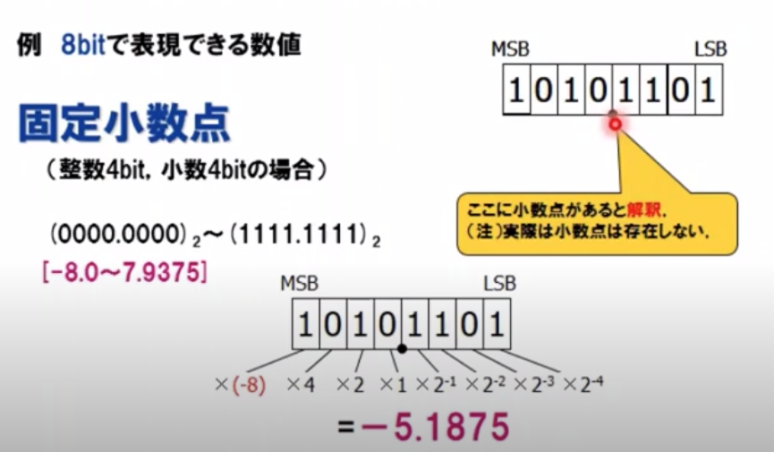

### 浮動小数点

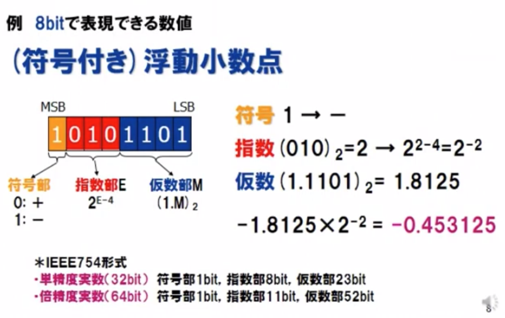
$$
例　指数(111)_2=7 \rightarrow 2^{7-4}=2^3
$$
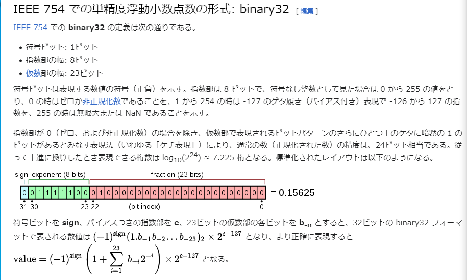

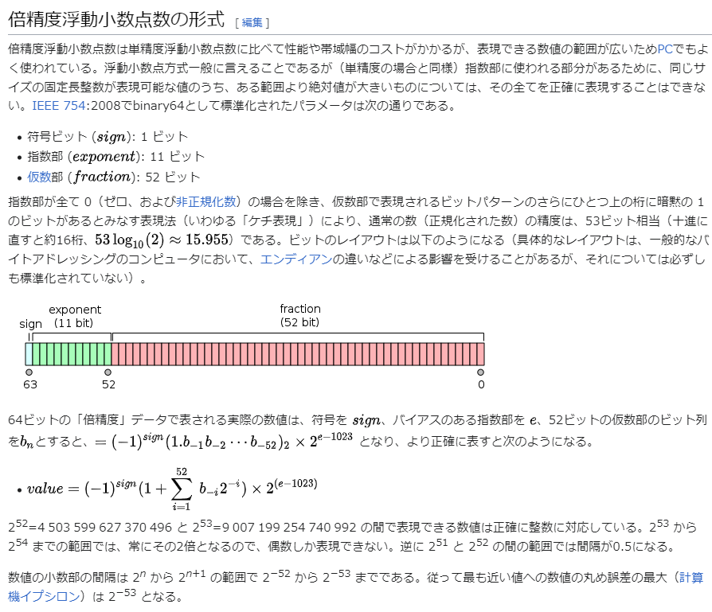
$$
value=(-1)^{sign}(1+\sum_{i=i}^{fraction}{b_{-i}2^{-i}})\times 2^{(e-2^{(exponent-1)-1})}
$$
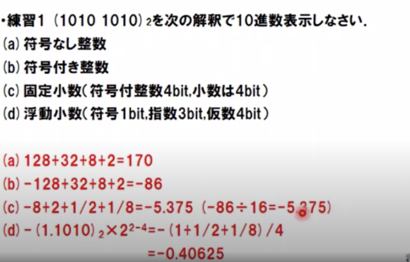

170

-86

-5.375

-0.40625

## 単語

### 重み

加权

### 補数表現

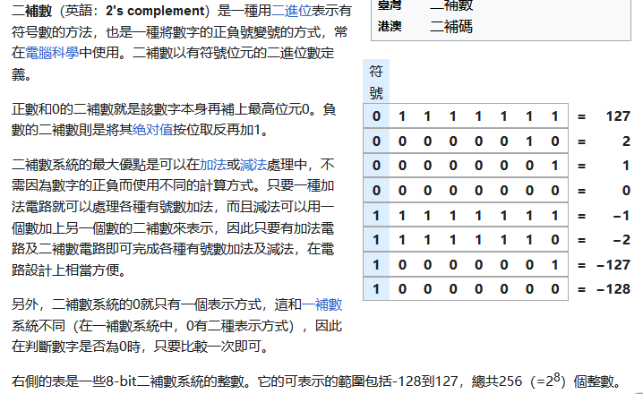

### 仮数

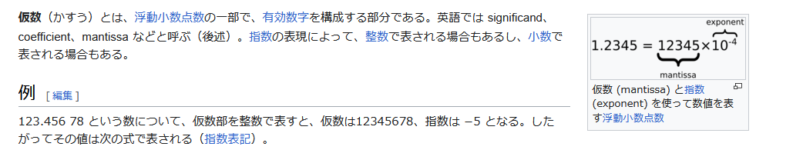