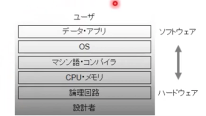
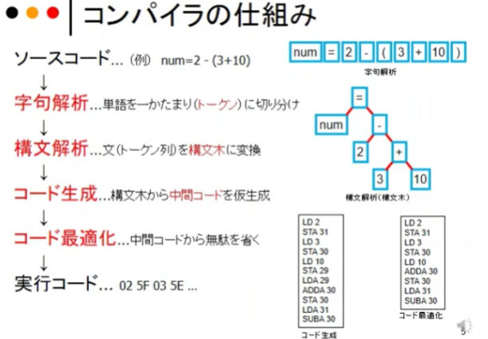
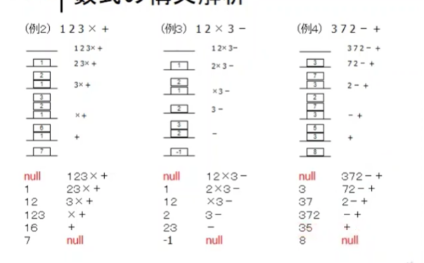
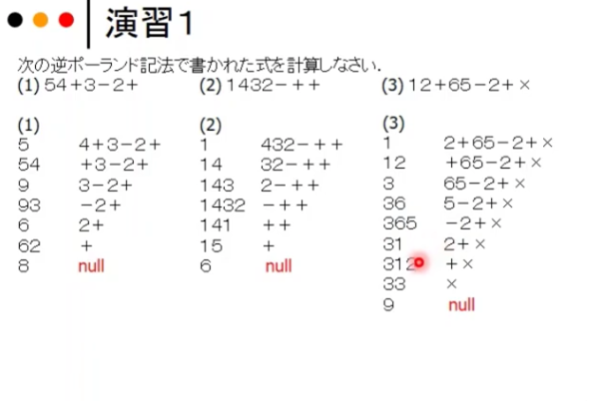
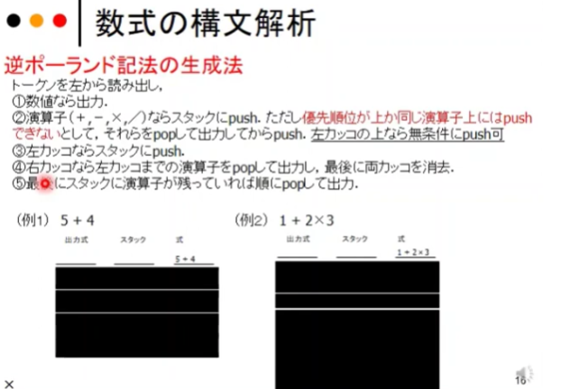
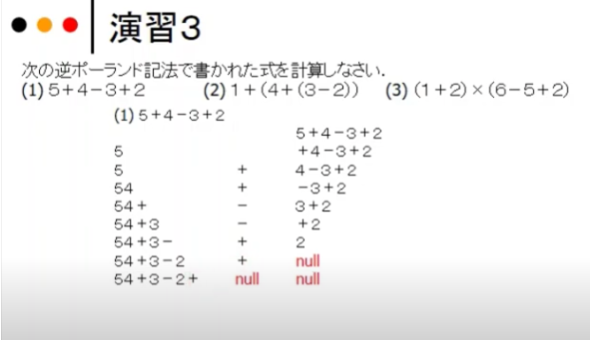
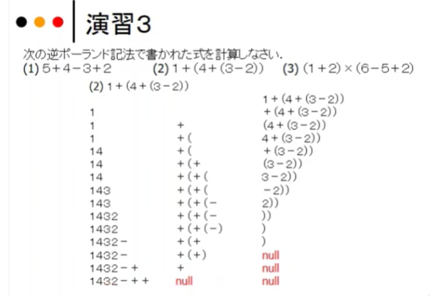
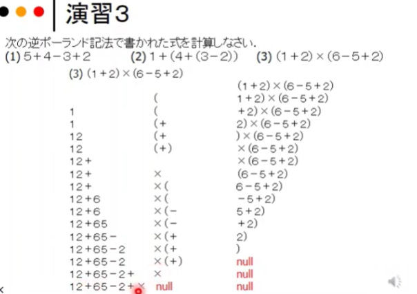

## コンパイラ

## 数式

## 逆ポーランド記法生成

## 简洁

计算机系统中的编译器（コンパイラ）是一种重要的软件工具，它将高级编程语言写成的源代码转换为机器语言代码，使得程序能够在特定的硬件平台上执行。以下是关于编译器的一些重要知识点的总结，提供中日双语版本以便于理解：

### 编译器的功能（コンパイラの機能）

- **语法分析（構文解析）**：编译器首先检查源代码的语法是否正确，包括词法分析和语法分析两个阶段。
- **语义分析（意味解析）**：编译器分析程序代码的含义，确保语句的逻辑正确性。
- **代码生成（コード生成）**：编译器将源代码转换成目标机器代码。这些代码通常更接近硬件层面，包括汇编语言或直接的机器代码。
- **优化（最適化）**：编译器对生成的代码进行优化，提高程序的执行效率和减少资源消耗。

### 编译器的类型（コンパイラのタイプ）

- **静态编译器（静的コンパイラ）**：编译发生在程序运行前，生成的是机器代码，直接由操作系统加载执行。
- **动态编译器（動的コンパイラ）/即时编译器（JIT コンパイラ）**：编译在程序运行时进行，常见于Java虚拟机和.NET框架中。

### 编译过程（コンパイルプロセス）

- **前端（フロントエンド）**：负责语言相关的分析和转换，生成一个中间表示（IR）。
- **优化器（オプティマイザ）**：对IR进行各种独立于机器的优化。
- **后端（バックエンド）**：将优化后的IR转换为目标机器代码，进行机器相关的优化。

### 编译器的挑战（コンパイラの課題）

- **平台依赖性（プラットフォーム依存性）**：编译器需要针对不同的硬件和操作系统调整，以生成有效的机器代码。
- **优化效果的平衡（最適化効果のバランス）**：编译器在优化代码时必须在编译时间和运行效率之间找到平衡。

### 应用（応用）

- **跨平台开发（クロスプラットフォーム開発）**：使用如Java等语言的编译器允许代码在多种硬件上运行，实现了真正的“一次编写，到处运行”。
- **高性能计算（ハイパフォーマンスコンピューティング）**：编译器优化对于高性能计算至关重要，可以显著提升程序的执行速度。

编译器是现代计算机系统中不可或缺的组件，它们使得高级编程语言编写的程序能够在各种计算机硬件上高效运行。对于程序员和系统设计师而言，理解编译器的基本功能和挑战是非常重要的。