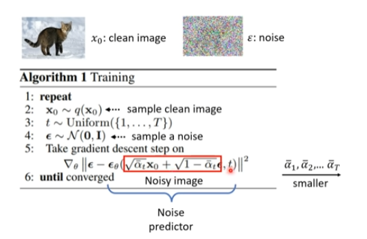

## 基本概念

## VAE vs Diffusion model

区别在于VAE中的encoder需要训练，add noise 的过程是固定的，并不是NN

## algorithm

### training

t越大，$\alpha$越小，意味着原图所占的比例越小（更多噪音）

t是$\epsilon_{\theta}$的输入

### Inference

## 影像生成模型本质上共同的目标

从一个简单的，可预测的distribution，通过NN使之取值范围尽量接近真正的distribution

### Maximum Likelihood Estimation

maximum likelihood estimation=minimize kl divergence

