## 基本概念

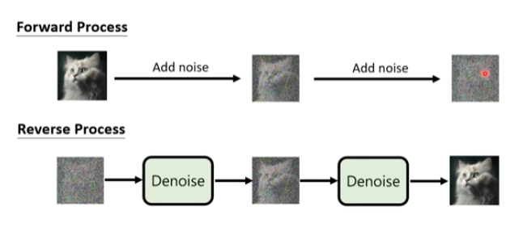

## VAE vs Diffusion model

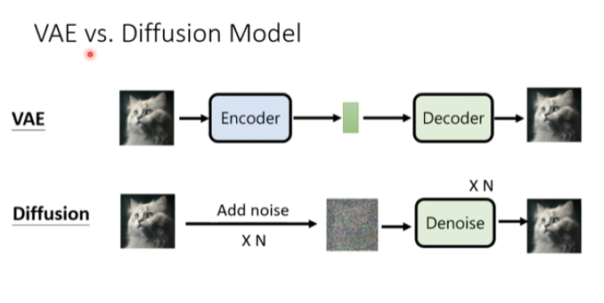

区别在于VAE中的encoder需要训练，add noise 的过程是固定的，并不是NN

## algorithm

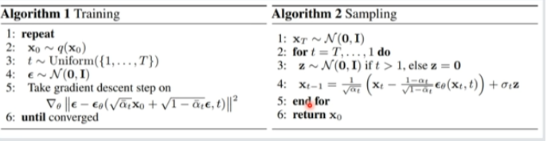

### training

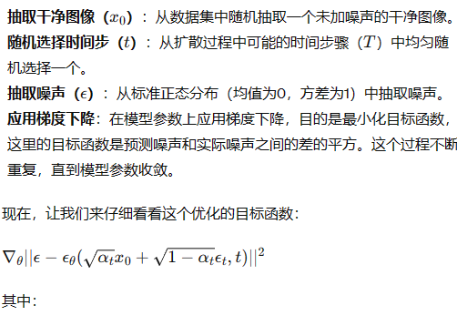

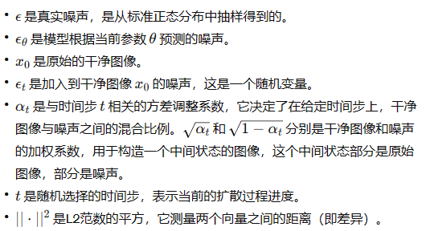

t越大，$\alpha$越小，意味着原图所占的比例越小（更多噪音）

t是$\epsilon_{\theta}$的输入

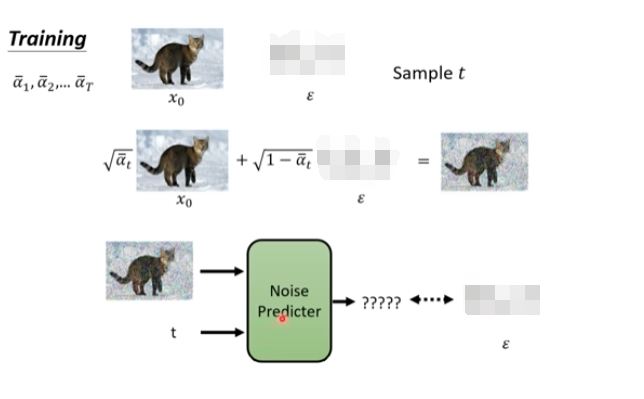

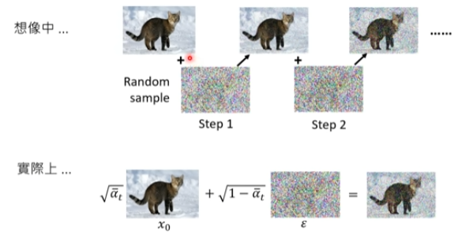

### Inference

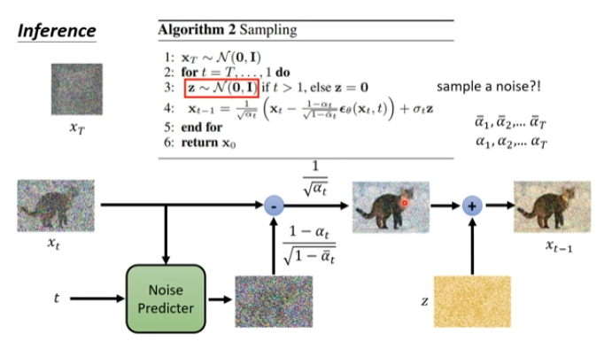

## 影像生成模型本质上共同的目标

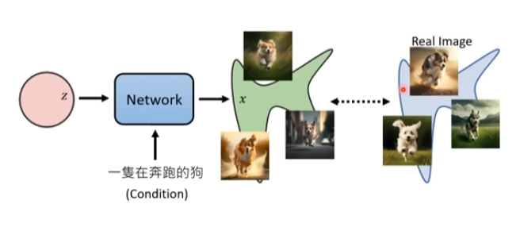

从一个简单的，可预测的distribution，通过NN使之取值范围尽量接近真正的distribution

### Maximum Likelihood Estimation

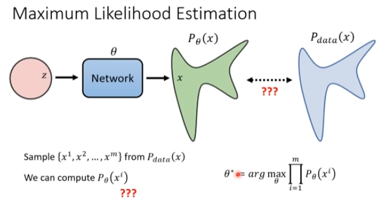

$\theta^*$：我们想要找到的参数向量，能够使$x^i$出现在$P_{\theta}$中的似然概率最大

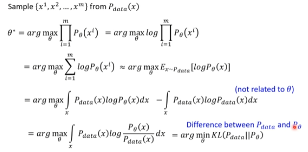

**在第二行中，这一步可以理解为**：

在训练集中的数据中sample所有 $x^i$，其在 $P_{\theta}$中的出现概率最大

$\approx$ 在真实数据 $P_{data}$中sample数据$x$，$x$在$P_{\theta}$中的出现概率最大

总而言之，以抽样数据推断整体

maximum likelihood estimation=minimize kl divergence

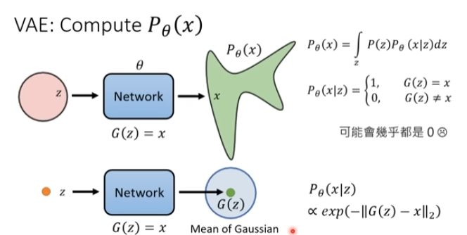

### probability density function 与divergence

$x$出现于$P$中的几率

正比于$G(z)$和$x$的divergence的负数

## VAE：Lower bound of $logP(x)$

## DDPM:Compute $P_{\theta}(x)$

这里为什么在假设$G(x_t)$的时候把他假设成一个高斯分布的mean？为什么不考虑他是更复杂的分布？为什么不考虑variance

以往的经验来讲考虑variance并不会让model结果更好，更复杂的分布也是一样。

