## Denoising Diffusion Probabilitics Models(DDPM)

### 如何运作

从gaussian distribution中sample一个vector，这个vector的dimension跟要生成的图片大小一样。

假设要生成一张256*256的图片，从normal distribution中sample出的vector要与其一致

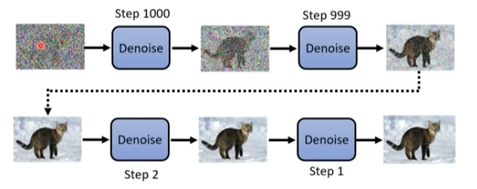

denoise的次数是事先确定的，我们通常会给denoise的步骤一个编号，最终生成的图片编号最小。

从正态分布采样到图片的步骤叫**Reverse Process**

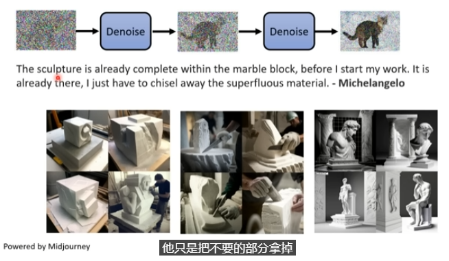

*根据来源自米开朗基罗的理论，雕像本来就已经存在于石块中了，雕刻只是把不要的部分去掉*

这里把同一个denoise的model反复使用。

但是，因为每一个状况输入的图片差异非常大，在最初输入的vector是一个纯噪音。

在倒数第二部中输入的图片是一个接近完成图的vector，所以如果时同一个模型，它可能不一定能够做得很好，

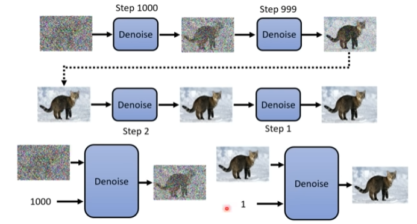

所以denoise的model，不但要被输入上一步的输出结果，还要多输入一个步骤数，即代表当前noise的严重程度。

### denoise model内部实际做的事情

内部有一个noise predictor：其所作的工作是预测当前输入的图片里面的噪音是什么样的，这个部分输入一个图片和步骤（噪音严重程度参数），预测输入图片中的噪音。

再使用输入的图片减去noise predictor输出的噪音，由此产生denoise的结果。

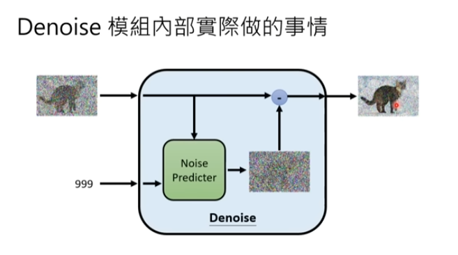

### 为什么这么做

预测噪声要比直接从随机噪声中学习生成数据简单，主要是因为这种方法为模型提供了一个更明确的学习目标和更稳定的训练过程。以下是几个核心原因和解释：

#### 渐进式学习和目标清晰

- **渐进式学习**：噪声预测器允许模型通过一个渐进的过程从噪声中恢复出清晰的数据，而不是一步到位地生成。这种逐步去除噪声的方法相当于提供了一个连续的学习路径，其中每一步都是一个相对简单且明确的去噪任务。这样的学习路径比直接从完全随机的噪声一步生成复杂数据的任务要简单得多。
- **目标清晰**：在噪声预测的任务中，模型的目标是预测在扩散过程中加入的噪声。这是一个有明确目标的回归问题，模型可以直接通过比较预测的噪声和实际加入的噪声来优化。相比之下，直接从随机噪声生成结构化数据是一个更抽象和复杂的目标，模型必须自行学习数据的内在结构和分布，这通常更加困难。

#### 训练过程的稳定性

- **减少模式崩溃风险**：在一些生成模型（如GANs）中，模型可能陷入模式崩溃（mode collapse），即只能生成有限的样本类型。而噪声预测的任务结构使得每一步生成过程都依赖于前一步的结果，这种依赖关系帮助模型覆盖更广泛的数据分布，减少了模式崩溃的风险。
- **训练稳定性**：扩散模型的训练过程通常比直接从噪声生成数据的模型更稳定，因为它逐步逼近目标数据，每一步的变化都较小。这种逐步逼近的过程使得模型训练更容易收敛，降低了训练过程中的不稳定性。

#### 数据和任务的适配性

- **对复杂数据结构的适应性**：噪声预测方法特别适合处理那些具有复杂结构和细节的数据（如高分辨率图像）。通过从包含部分结构信息的噪声数据中逐步恢复出完整数据，模型可以更有效地学习并保留数据的细节和复杂性。
- **简化学习任务**：将生成任务分解为一系列的去噪步骤，相比直接从完全的随机噪声中生成完整的数据，显著降低了学习任务的难度。每一步只需关注如何根据当前的部分噪声数据恢复出更清晰的数据，而非一次性解决整个复杂的生成任务。

总之，通过预测和去除噪声来生成数据，Diffusion模型提供了一种结构化且逐步的方式来学习数据的复杂分布，相比直接从随机噪声生成数据，这种方式更容易训练，且能产生更高质量的结果。

### 如何训练noise predictor

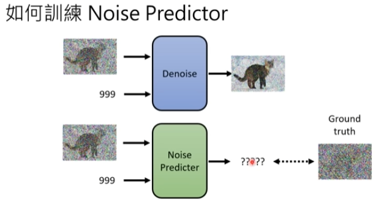

产生一个预测出来的噪音需要有ground truth，在训练network的时候，需要有pair data才能训练。

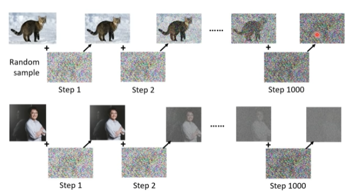

noise predictor的训练资料是人为创造的，将random sample添加到真实图片中。重复上述过程。

这个过程叫forward process，又叫做diffusion process。如此一来，就有noise predictor的训练资料了。

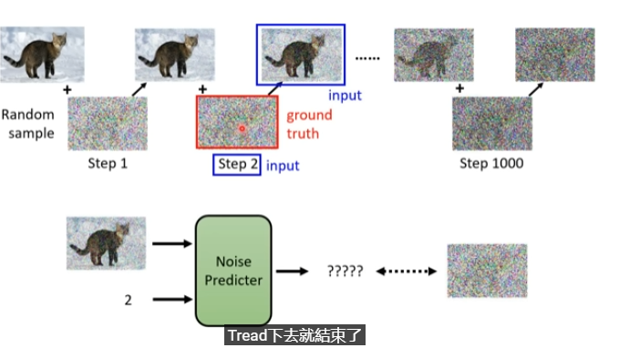

### Text to Image

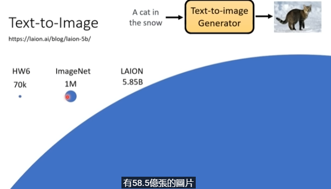

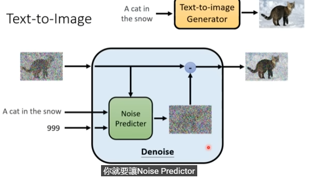

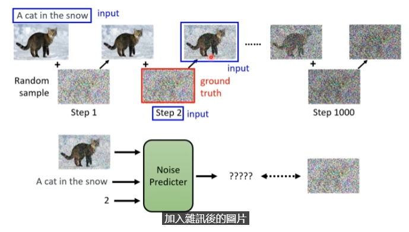

### algorithm

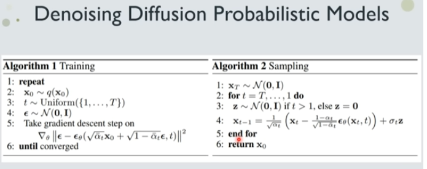