## Framework

今天最好的图像生成模型，其中基本上都有三个元件：

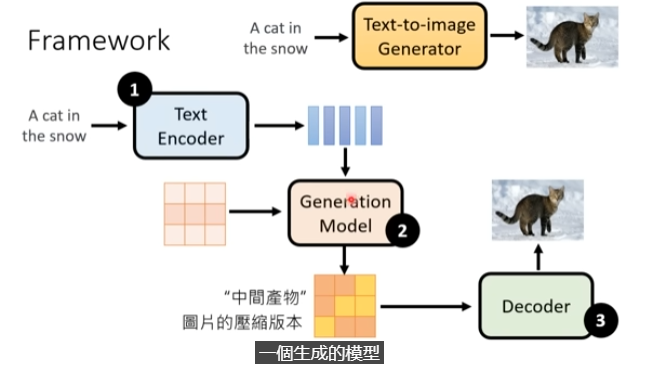

第一个元件，是一个**text encoder**，将一段文字的叙述转化为数个向量

第二个元件是一个**generation model**，这个model的功能是输入一个噪音，再输入上述的文字vector，产生一个中间产物（“图片的模糊微缩版本”或“根本看不懂的图片”，是一个图片被压缩过后的结果）

最后嵌套一个**decoder**，它的作用是从压缩后的版本回归原始状态（生成结果）

通常是将三个模型分开训练再组合。

### stable diffusion

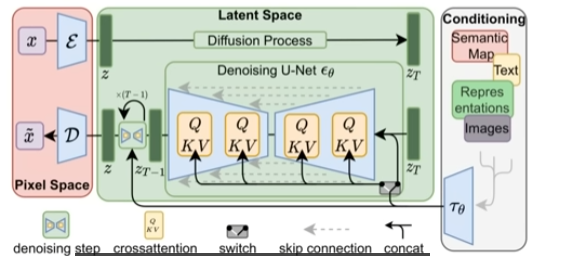

### DALL-E

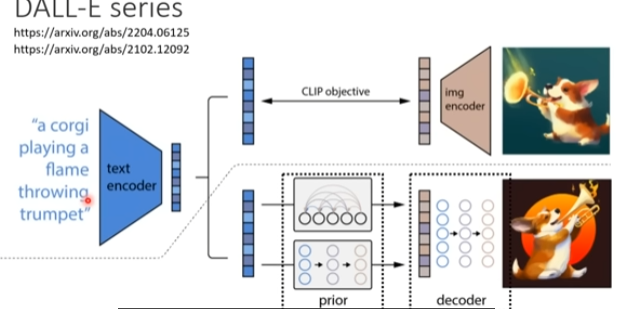

### Imagen

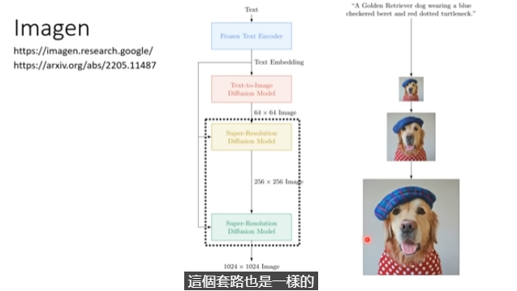

## Text Encoder

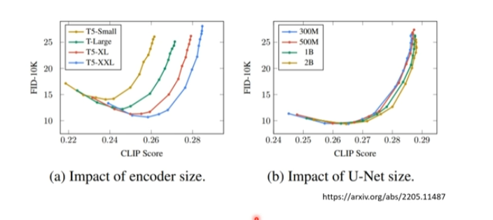

文字的encoder的效能对最后生成图片的结果至关重要。

相对而言，diffusion model的大小就没那么重要

## FID

Frechet Inception Distance

如何评价一个图片生成的好还是不好

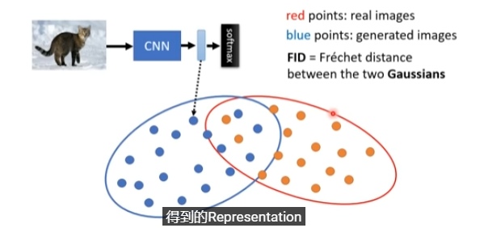

如果两组数据越近，就说明真实影像跟生成图片越接近

（此处假设两个presentaion是高斯分布）

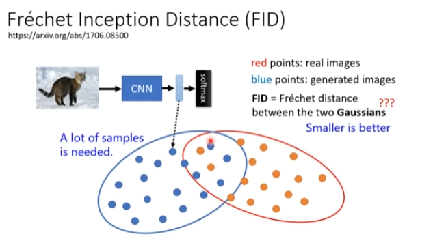

缺点是需要生成大量图片来测量FID

## Constrastive Language-Image Pre-Training(CLIP)

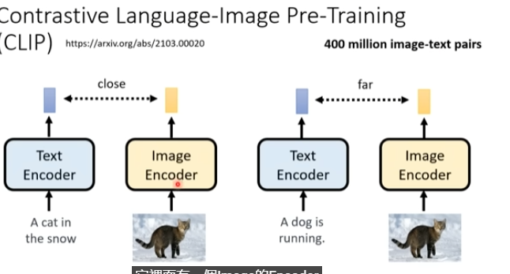

是使用四亿个图片文字数据对所训练的模型

它内部有一个image encoder，有一个text encoder。

text encoder输入一段文字，输出一个向量

image encoder输入一个图片，输出一个向量。

如果两个数据是成对的，那么两个vector就要越近越好，繁殖则越远越好。

## Decoder

在训练的时候不需要与图片对应的文字生成资料

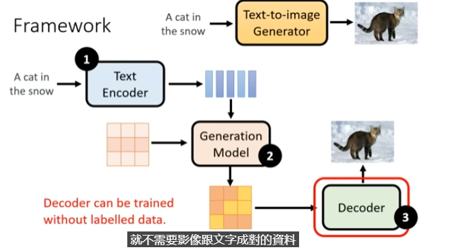

训练generation model需要文字跟图片成对的资料，

但是单单训练decoder只需要图片

### 训练

把已有的图像做下采样，再把小图训练成大图，就完成了（Imagen中的情况）

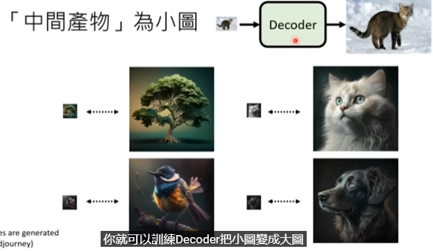

如果中间产物是某种latent presentation（在stable diffusion和DALL—E中的情况）

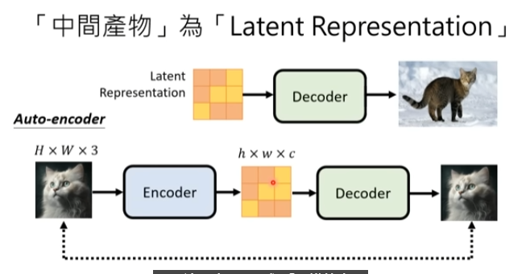

#### latent presentation

可能您指的是"latent representation"（潜在表示），这是一个在机器学习和深度学习中常见的概念。潜在表示是指通过模型从输入数据（如图像、文本或声音等）中自动学习到的、通常是高维空间中的数值向量表示。这种表示旨在捕捉输入数据的内在特征和结构信息，而这些信息对于直接观察并不显而易见。

##### 潜在表示的重要性

- **数据压缩和特征提取**：潜在表示能够将原始数据压缩到较低维度的空间中，同时保留数据的关键特征。这对于降低计算成本和提高模型效率非常重要。
- **提高模型泛化能力**：通过学习潜在表示，模型可以更好地理解数据的抽象特征，从而提高对未见过数据的泛化能力。
- **支持多种下游任务**：一旦学习到良好的潜在表示，它可以被用于多种不同的任务，如分类、回归、生成等，增加了模型的灵活性和可用性。

##### 如何获得潜在表示

潜在表示通常是通过无监督学习或半监督学习得到的。以下是几种常见的方法：

- **自编码器（Autoencoders）**：通过学习输入数据的压缩表示然后重构数据，自编码器能够提取数据的潜在表示。
- **生成对抗网络（GANs）**：在GANs中，生成器网络学习将潜在空间中的随机向量映射到数据空间，以此方式学习数据的潜在表示。
- **变分自编码器（VAEs）**：VAEs是一种特殊类型的自编码器，通过引入概率图模型来学习输入数据的潜在表示，同时确保潜在空间的连续性和平滑性。
- **深度学习模型中的隐层**：在深度神经网络中，隐层（尤其是接近输出层的那些）可以视为输入数据的潜在表示。

##### 应用示例

在自然语言处理（NLP）中，词嵌入（word embeddings）如Word2Vec或BERT提供了单词的潜在表示，捕捉了单词之间的语义关系。在计算机视觉中，通过卷积神经网络（CNNs）处理的图像在网络的深层中形成的特征可以被视为图像的潜在表示，这些表示对于图像分类、目标检测等任务非常有用。

总之，潜在表示是从原始数据中自动学习到的，它们为多种机器学习和深度学习任务提供了强大的数据理解和表示能力。

## Generation model

输入文字的潜在表示，再输入产生latent presentation或者微缩图

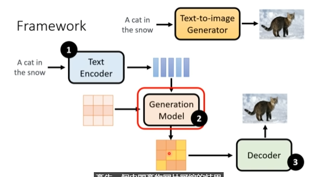

### 怎么做

这一过程与diffusion process不同的地方是，不再是直接将noise添加到图片上。而现在需要diffusion model产生出来的已经不是图片了，而是中间向量。

所以要把noise添加在中间产物（latent presentation）上。

先使用一个encoder，输入图片产生一个latent presentation，sample一个噪音，添加在latent presentation上。重复此过程

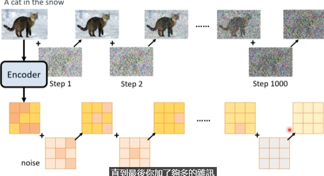

然后训练一个noise predictor，

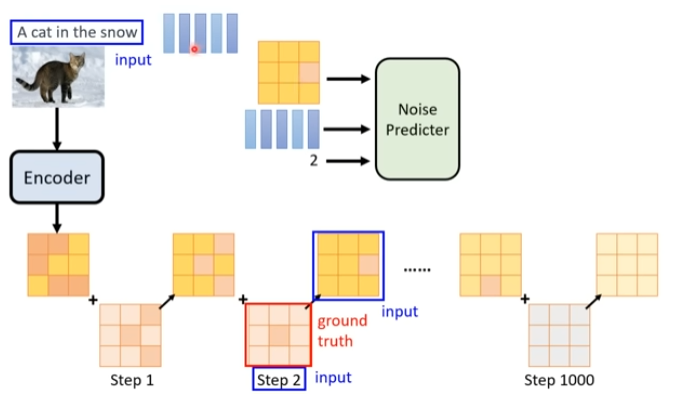

生成的时候

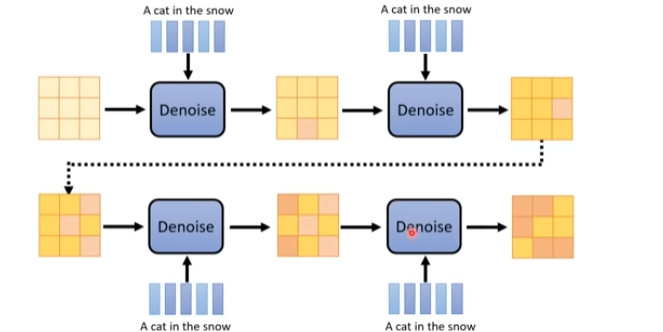