# IT日语速成 1

## 日语翻译特点

1. 日语是黏着语，要靠助词来表示各个单词在句中的机能。
2. 日语主语在首，谓语在最后。跟汉语最大的区别就是主谓宾。故翻译的时候要从后向前。

## 动词

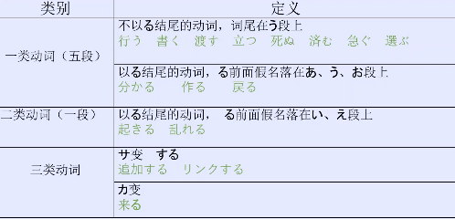

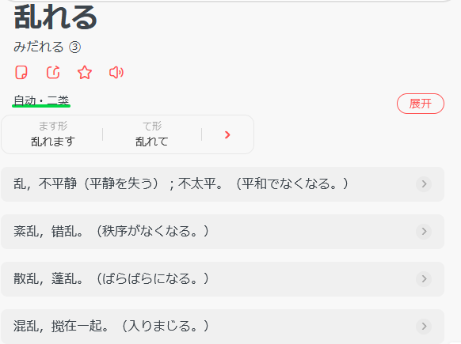

## 助词

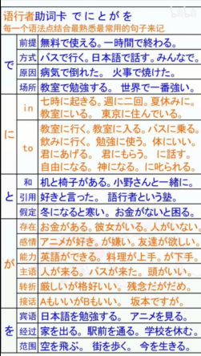

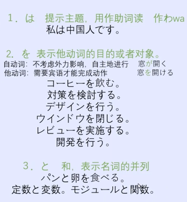

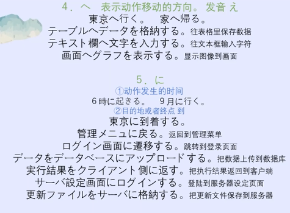

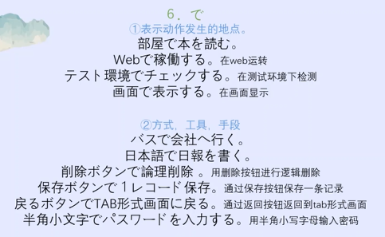

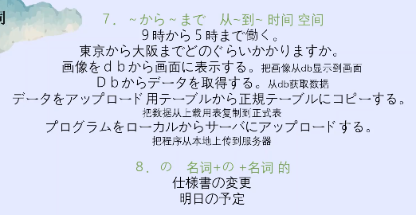

## 补充单词

#### モジュール

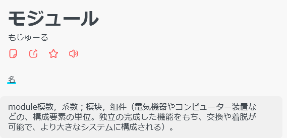

#### 関数

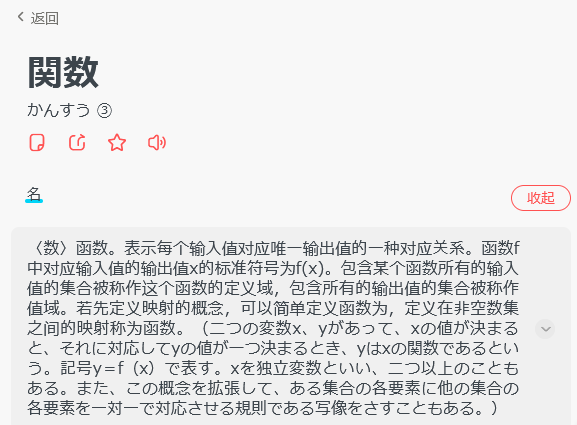

#### ウインドウ

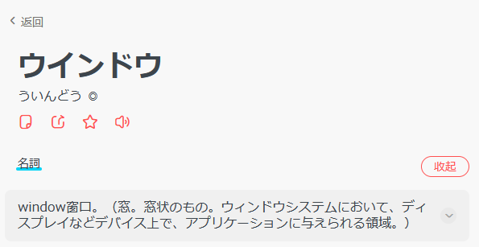

#### レビュー

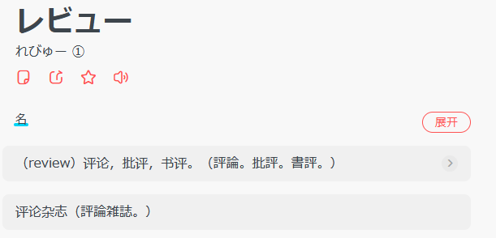

#### 定数と変数

常量和变量

#### 遷移

页面跳转

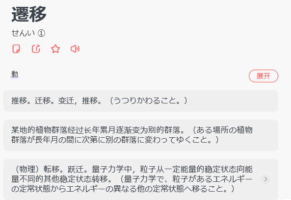

#### クライアント

客户端

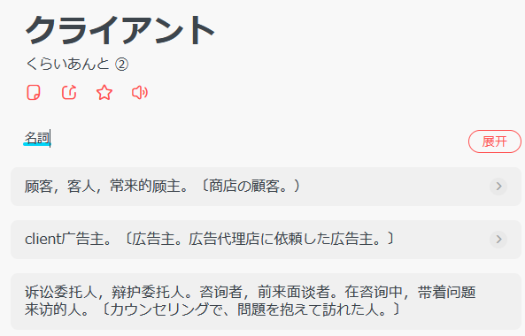

#### サーバ

server；服务器

#### ファイル

file；文件

#### 格納

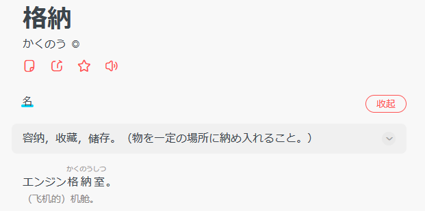

#### 稼働

运作，运转

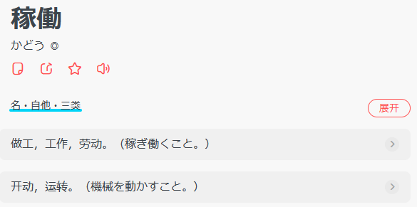

#### 日報

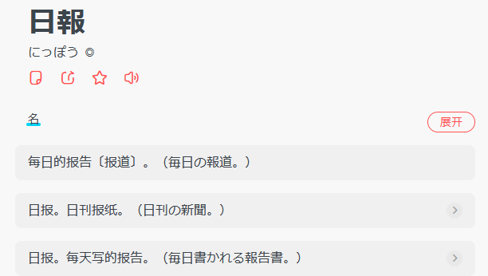

#### 論理削除

逻辑删除

#### レコード

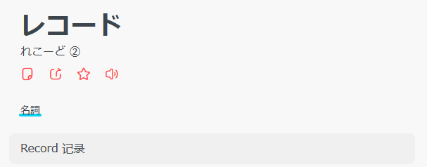

#### 半角

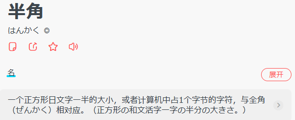

#### ローカル

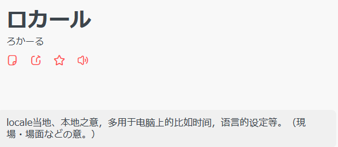

#### 仕様書

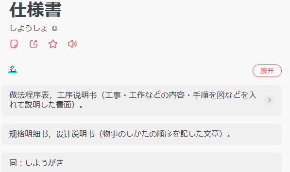

### 其他单词补充

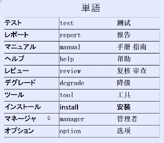